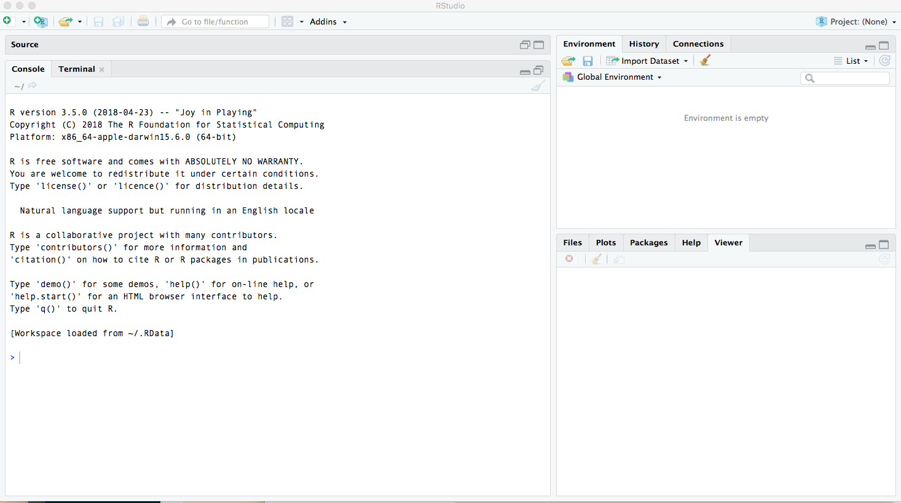

```{r setup, include=FALSE}
knitr::opts_chunk$set(echo = TRUE)
```

## Introduction
By now you should have installed both **R** and **R Studio**. Why do we need both? **R** is a programming language (think, something like an Operating System, OS) and comes with a basic graphical interface, but it's quite challenging to use because it is very bare bones. Consequently, several *integrated development environments* (IDEs) have been developed that make it easier to interact with **R**--**R Studio** is one such IDE. In this case, you can think of the IDE like the device that you personally use to run your OS.  Let's start by opening the **R Studio** application. You should see something like this:



You can think of the **R Studio** interface as divided into 4 quadrants although currently there are only 3 areas that are visible. The left hand space is currently taken up by the *Console*. This is where you can enter R commands directly. You can enter any commands at the cursor:

> \>

### Console
First, and foremost, R can be used as a calculator. Go ahead and enter simple arithmetic operations in the Console.

```{r}
2+6
12-5
3*8
44/7
2^3
```

We can also enter some basic commands into the Console.

```{r}
sqrt(4)
sum(2,6,8)
rnorm(10)
```

Notice that with the last command, we got multiple values in our output, and consequently, the values inside of the brackets have changed. 

* What do the values in the bracket mean?
* What is the `rnorm()` command doing?

Whenever working with unknown commands (or needing to look up how the command is used), you can access the help menu. There are several ways to do this.

* type `?rnorm()`
* navigate to the help tab in the lower right quadrant and type in the command name
* Google it!

The help files are a little daunting at first, but they contain some important information. In this case, we see that `rnorm()` is a part of a family of functions that work with the *normal distribution* (a statistical concept that we'll cover later, but think 'bell curve'). For `rnorm()`, we see specifically the following **Usage** documentation:

> `rnorm(n, mean = 0, sd = 1)`

How can this be if we only entered one value with our command? Look down further under the **Arguments** documentation and find `n`, `mean`, and `sd`. What do you see? What did we input?

The remainder of the non-specified arguments have *default* arguments, which we did not have to input. These default values are a *mean* of 0 and a *standard deviation* of 1 (we'll cover these statistical concepts later, but think 'central point' and width of bell curve). We can change these default arguments by specifying new ones.

```{r}
rnorm(10, mean = 1000, sd = 300)
```

Notice that these values are much larger than the original values because of how we changed the arguments. 

Look up the help files of `rep()` and `seq()` and try to create a sequence from 1 to 5 that repeats 3 times.

## Environment

In the upper right-hand quadrant you see an Environment pane that is currently empty. This is where you will see any *data sets* and *variables* that you create (or import). Let's build off of the simple arithmetic operations that we created earlier and do some simple algebraic operations. To assign something to a variable, we want to get into the habit of using the *assignor* operator, which looks like a left-pointing arrow `<-` (there are other ways to accomplish the same thing, but I want you to get into the habit of doing it this way to prevent any confusion down the road). There is a keyboard shortcut for this opeartor: `ALT/OPTION + -`. You should get in the habit of using keyboard shortcuts, especially for any processes that you repeat frequently. To access the shortcuts reference page, type `ALT/OPTION + SHIFT + K`. 

First, let's just assign some simple variables:
```{r}
a <- 3
b <- 6
```
Notice what happened in the **Environment** pane. We now have our variables listed (as well as their values). 

Compare the following two operations:
```{r}
a*b
c <- a*b
```

Notice that you can either ccontinue to get output from some operation on variables or you can store that output to a new variable, in which case, you would need to call that variable to see its value.
```{r}
c
```

We can also store multiple values to variables and call our variables any (meaningful) name that we want.
```{r}
seq1 <- rnorm(10)
seq2 <- rnorm(10, mean = 20, sd = 2)
seq3 <- rnorm(7, mean = 30, sd = 4)
```
Notice how the variables are stored in the **Environment** pane.
Again, we can perform simple operations on sequences of variables as long as it's legit to do so. 
```{r}
seq2 - seq1
seq2/4
seq3 - seq2
```
Notice that we get a warning message in the last operation. What do we do with warnings and errors? Don't ignore them! They can be helpful even if they take a while to get used to. If all else fails, copy the error message into google and see what pops up!

Let's learn one other useful function for variables. When combining multiple values, you will need to *concatenate* these values. We use the `c()` command to do so. 
```{r}
values <- c(2,7,8,3,2,9,7)
#try doing so without the c() command
#values2 <- (2,7,8,3,2,9,7)
```

Let's combine this all together and perform vector arithmetic. 

```{r}
weight <- c(60, 72, 57, 90, 95, 72)
height <- c(1.75, 1.80, 1.65, 1.90, 1.74, 1.91)

bmi <- weight/height^2
bmi
```

We haven't significantly talked about 2 other panes. One is the **Source** pane, which is where we will be writing our scripts and notebooks. This will become relevant later. Then, the pane where we found the Help files also contains other useful functions. I call it the **Kitchen Sink** pane. Besides the help files, any plots (graphs) that we build will show up here as well as a navigation pane for file directories and for packages (we'll discuss this more later in the semester). 

## Importing Data, Indexing, and Subsetting

The secret to importing data is:

* knowing where you are (*working directory*)
* knowing where your data file is (*file path*)
* knowing the file extension of your data

Later on, we'll be using some R Studio functionality that makes handling working directories much easier, but you can see where your current working directory is pointed towards at the top of the Console pane. 

In my current directory, I have a folder called *Data* that has a `.csv` data file called "sample_data.csv". Let's import that data set into R Studio.

```{r}
sample <- read.csv("data/sample_data.csv")
```
What happened in the **Environment** console? What happens when you click on *sample*?

One of the hardest learning curves of working with R is that you have to get comfortable not looking at your data all of the time. There are some very helpful functions that help make you get familiar with the structure of your data file and gives you quick descriptives. 

```{r}
head(sample) #prints first 6 rows
tail(sample) #prints last 6 rows
str(sample) #gives structure of data columns
summary(sample) #gives summary for each column
```
The `str()` function is extremely valuable because it lets you knw what type of column R thinks you have. We'll work a lot more with this concept in 2 weeks but for the time being, it's sufficient to know that the following are the most typical variable classes:

* *factor*: these are systematic, categorical variables (like Sex, Race, Political Party, Proficiency)
* *integer*: these are whole numbers
* *numeric/double*: these are numbers with decimal values
* *logical*: binary variable with TRUE/FALSE or 0/1 outcome levels
* *character*: character strings or text

What do we have in our sample data set?

To navigate or select specific values in your data set, we will be using *indexing* and *subsetting*. One method of indexing is to specify row and column values within single brackets '[]'.

```{r}
sample[6,]
sample[,3]
```
The first command selects the 6th row and the second command selects the 3rd column. So remember the order: RC, rows, then columns:


We can combine both together to get a single cell.
```{r}
sample[6,3]
```
This is the value for the 6th row and 3rd column. 

When referencing colums, we can also use the '$' to index column names (which makes things a little more transparent).
```{r}
sample$response_accuracy
```
This part may not seem useful on its own but what makes indexing powerful is that you can also combine it with conditional statements, which allows you to subset your data. Let's say that we only want to see trials in which participants answered correctly. we can use the following to show only rows that are correct.
```{r}
sample[sample$response_accuracy == "correct",]
```

Notice that the conditional is in the bracket and that we are still using the comma. Essentially, the syntax reads: give me all rows in the data frame `sample` where `response_accuracy` equals "correct". Notice that we had to use 2 equal signs. Although it is a little bit confusing, in R, you need to write `==` to mean 'equals.' Use a single `=` to change default arguments, provide new arguments, or name new column headers (to be discussed later). What happens if you only write what is inside of the brackets without the comma?

An even more typical operation for us would be to get the mean proportion of correct answers for the entire experiment. 
```{r}
mean(sample$prop[sample$response_accuracy == "correct"])
```
We have just asked for the mean of the values in the prop (Proportions) column conditioned by including only rows where response_accuracy was correct. We don't need the comma in the brackets this time because since we are only working on a column (sample$prop) there is no other column that we can reference within the brackets. 

Now try to find the mean count of incorrect trials for all participants. 

The conditional statements within the brackets can also be combined. Let's say that we want the mean proportion of correct responses only for E trials (E refers to an auxiliary type which was a by-design manipulation in the experiment).
```{r}
mean(sample$prop[sample$response_accuracy == "correct" & sample$aux_type == "E"])
```

Notice that we are combining two conditionals with an '&' operator. There are several other *Boolean* operators that we can use, but we'll work on those later. 

Let's read up on the `subset()` function.
```{r}
?subset()
```
Take a look at the **Examples** at the help page. Can you figure out how to subset the data to only those participants who scored better than 80% on correct trials? 
