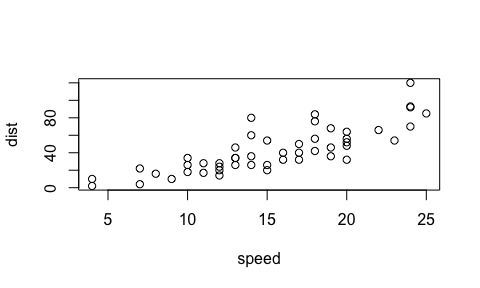

##Why R Markdown?
why should we use R Markdown? It provides a unified framework for authoring documents that contain the code, the output of the code, and any additional commentary or text that we would want to include. It's written in a simple markdown language (this is what the *md* stands for). This requires a smooth learning curve, which is not too hard to pick up with a little practice. With this single document we can:

*communicate our findings to a senior author/collaborator or other interested party who may not necessarily be interested in the specifics of how the analysis is carried out (you can hide the code chunks)  
* as a write-up for collaborators who are interested in the code and the results (this could even be you in a future study)  
* As a self-containing environment for conducting data science

I can't emphasize enough how much of a difference using R Markdown has made to my own workflow, in making my code more efficient (in conjunction with `tidyverse`) and in simplifying my own ability to look back on what I did. 

In my own pre-R markdown/tidyverse world, I used to work with the script editor. This meant that my script was pretty clunky, with lots of commented code (non-executable code) as well as many intermediate steps. In other words, I had to save intermediate data frames to check on my work. Now I can accomplish this all in a single document.

Take a look at my prior workflow.

1. I would write code where it was hard to visualize where the different sections occured.


2. Then, I would have a very messy file directory with a whole bunch of intermediate files.


Now, everything is much more simplified.

Including my file directory:


So I really want to highly encourage you to use the R Markdown funcitonality even beyond my class. It's essentially like keeping a lab notebook, which can easily be converted into a final product. In fact, it's possible to write-up journal article submissions and even conference presentations all within R Studio. These are obviously more advanced topics, but it's something you can look forward to as you progress with your own skillset!

##Getting Started
Open _R Studio_ and go to _File > New File > R Markdown_. You'll see the Source pane take over (the Console will become hidden) and you'll see a simple (nearly) blank template. You can also try _R Notebook_. Go ahead and open an _R Notebook_ file and compare the differences across both templates. 

What you now have is an [R Markdown](http://rmarkdown.rstudio.com) document. When you execute code within the document, the results appear beneath the code. There are three important types of content.

1. A _YAML_ header, which has ---s
2. R code chunks surrounded by ```s (and appearing in gray)
3. Text containing additional formatting

Try executing this chunk by clicking the *Run* button within the chunk or by placing your cursor inside it and pressing *Cmd/CTRL+Shift+Enter*. 


```r
plot(cars)
```

<!-- -->

Add a new chunk by clicking the *Insert Chunk* button on the toolbar or by pressing *Cmd/CTRL+Option/ALT+I*. And add some simple arithmetic operations. Then run your code


```r
2 + 2
```

```
## [1] 4
```

```r
20 - 2
```

```
## [1] 18
```

Notice that the results are printed right below. Let's go ahead and render this document. Select the **Knit** button above and notice what happens. You get an html version of your document as well as any other output that you ask for (e.g., word, pdf). 

When you save an R notebook, an HTML file containing the code and output will be saved alongside it (If using an R notebook, click the *Preview* button or press *Cmd/CTRL+Shift+K* to preview the HTML file.The preview shows you a rendered HTML copy of the contents of the editor. Consequently, unlike *Knit*, *Preview* does not run any R code chunks. Instead, the output of the chunk when it was last run in the editor is displayed.)

#Tutorial
Here are some text formatting aspects that can be done within the text portion of the notebook:

##Headings
# 1st Level Header
## 2nd Level Header
### 3rd Level Header

##Formatting
*italic* or _italic_
**bold** or __bold__
`code`
superscript^2^ 
subscript~2~

##Lists
* Bulleted Item 1
* Item 2
  + Item 2a
  + Item 2b
  
1. Numbered Item 1
1. Item 2. (numbering is automatic)

##Links and images
For links:
<http://docs.ggplot2.org>

[ggplot2 documentation](https:/docs.ggplot2.org)


##Tables

First | Second
------ | ------
a | b
c | d

##Other
You can write in-line equations using $\LaTeX$ formatting: $SEM = \sigma/\sqrt n$. 

Create a horizontal rule:

***

Create a block quote:

> Important stuff was said

##Inserting chunks
Use **CMD/CTRL+OPTION/ALT+i** to insert a code chunk:

```r
a <- 3
b <- 4
c <- a*b
c
```

```
## [1] 12
```
You can give an R chunk a name by adding above within `{}` after the **r**.
Use **CMD/CTRL+SHIFT+ENTER** to run code chunk. Results will appear after chunk in notebooks!

##Basic Shortcuts Summary
These are in my opinion, the most important shortcut keys to remember in R:

* __OPTION/ALT+-__ creates the assignment operator `<-`  
* __CMD/CTRL+SHIFT+m__ creates the pipe operator `%>%` very important for `tidyverse`  
* __CMD/CTRL+OPTION/ALT+i__ inserts a code chunk  
* __CMD/CTRL+SHIFT+ENTER__ executes all code within a chunk  


```r
library(tidyverse) #to load in tidyverse library
```

```
## ── Attaching packages ─────────────────────────────── tidyverse 1.2.1 ──
```

```
## ✔ ggplot2 2.2.1     ✔ purrr   0.2.4
## ✔ tibble  1.4.2     ✔ dplyr   0.7.4
## ✔ tidyr   0.8.0     ✔ stringr 1.3.1
## ✔ readr   1.1.1     ✔ forcats 0.3.0
```

```
## ── Conflicts ────────────────────────────────── tidyverse_conflicts() ──
## ✖ dplyr::filter() masks stats::filter()
## ✖ dplyr::lag()    masks stats::lag()
```

```r
#create a tibble of fake data
fake_data <- tibble(
  Subject = rep(seq(1:10),2), #repeat a sequence from 1 to 10, twice
  Condition = c(rep("easy", 10), rep("hard", 10)), 
  Fake_RT = c(rnorm(10, mean = 250, sd = 2.5), rnorm(10, mean = 294, sd = 2.5))
)
print(fake_data)
```

```
## # A tibble: 20 x 3
##    Subject Condition Fake_RT
##      <int> <chr>       <dbl>
##  1       1 easy         250.
##  2       2 easy         247.
##  3       3 easy         253.
##  4       4 easy         252.
##  5       5 easy         251.
##  6       6 easy         247.
##  7       7 easy         251.
##  8       8 easy         246.
##  9       9 easy         249.
## 10      10 easy         249.
## 11       1 hard         290.
## 12       2 hard         300.
## 13       3 hard         297.
## 14       4 hard         294.
## 15       5 hard         293.
## 16       6 hard         297.
## 17       7 hard         293.
## 18       8 hard         296.
## 19       9 hard         293.
## 20      10 hard         293.
```
Now let's do something very simple with `tidyverse` in a code chunk. Let's summarize the *mean* and *sd* for our fake data by the levels of **Condition**:

```r
group_fake_data <- fake_data %>% 
  group_by(Condition) %>% 
  summarize(meanRT = mean(Fake_RT), sdRT = sd(Fake_RT))
print(group_fake_data)
```

```
## # A tibble: 2 x 3
##   Condition meanRT  sdRT
##   <chr>      <dbl> <dbl>
## 1 easy        249.  2.31
## 2 hard        295.  2.64
```
And let's end by running a paired t-test, since there are two data points per Participant, one for the *easy* condition and one for the *hard* condition.

```r
#formula method for paired t-test
t.test(Fake_RT ~ Condition, data = fake_data, paired = TRUE)
```

```
## 
## 	Paired t-test
## 
## data:  Fake_RT by Condition
## t = -35.088, df = 9, p-value = 6.131e-11
## alternative hypothesis: true difference in means is not equal to 0
## 95 percent confidence interval:
##  -47.97858 -42.16676
## sample estimates:
## mean of the differences 
##               -45.07267
```

```r
#indexing method for paired t-test
t.test(fake_data$Fake_RT[fake_data$Condition == "easy"], fake_data$Fake_RT[fake_data$Condition == "hard"], paired = TRUE)
```

```
## 
## 	Paired t-test
## 
## data:  fake_data$Fake_RT[fake_data$Condition == "easy"] and fake_data$Fake_RT[fake_data$Condition == "hard"]
## t = -35.088, df = 9, p-value = 6.131e-11
## alternative hypothesis: true difference in means is not equal to 0
## 95 percent confidence interval:
##  -47.97858 -42.16676
## sample estimates:
## mean of the differences 
##               -45.07267
```
You see that in both instances of running the `t.test()` that we got the same results. Because all of our dependent variable is contained in one column, I would recommend using the *formula syntax* method. The *indexing* method is more helpful when you have your dependent variables split across two columns. 

##Chunk options
There is a lot of flexibility to customize what the code chunks do. Probably the most important are `eval = FALSE` `echo = FALSE` and `results = 'hide'`. These each respectively, suppress code from running but print it, hides the code but produces the output, runs the code but hides the output. Just add these additional arguments to the end of the chunk name. Let's prevent output from printing.


```r
first <- 23
second <- 54
third <- first + second
```

However we know that a new variable was created.

```r
third^2
```

```
## [1] 5929
```

Some of these options may be useful for writing up reports that don't need to show code (maybe for a class paper or for a senior colleague/advisor) or if you don't need to show intermediate steps that may make the output document very long.

##Additional Resources
Here are some additional resources that are very helpful. The first link is for a simple tutorial that we are going to practice in class today. The second is for a reference sheet published through R Studio.

* [Markdown Tutorial](https://www.markdowntutorial.com/)  
* [R Markdown cheatsheet](https://rmarkdown.rstudio.com/lesson-15.html)

##Your turn
Now that you have the beginning steps to create your own document, I want you to "write up a report" on a dataset titled **CSLex_subset.csv** that can be found in the _data_ folder in our _Methods_ repository on GitHub. 

Download this dataset to a local directory. Set your workind directory to that directory path and import the dataset. Then, just play around with some of functions that we learned last week to get a sense for the _structure_ of the data set. Just remember to write some prose on what you are trying to do, then insert code chunks to do things, then execute the code within each chunk. You can turn in your final report to me as a pdf or word document. 
