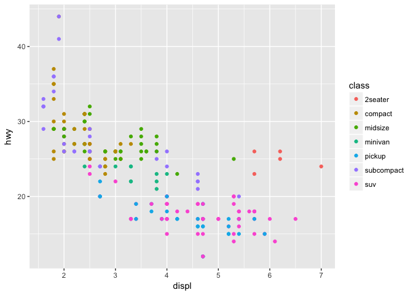
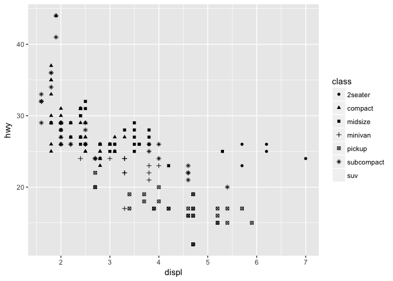
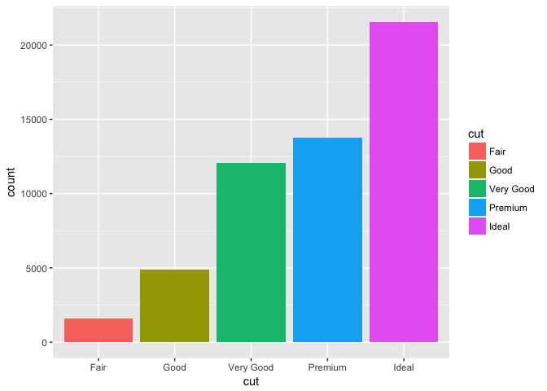
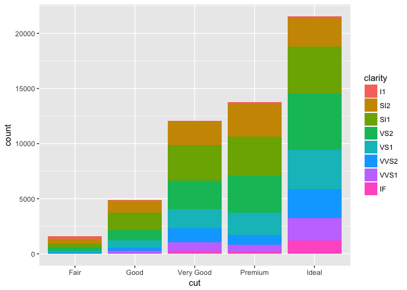
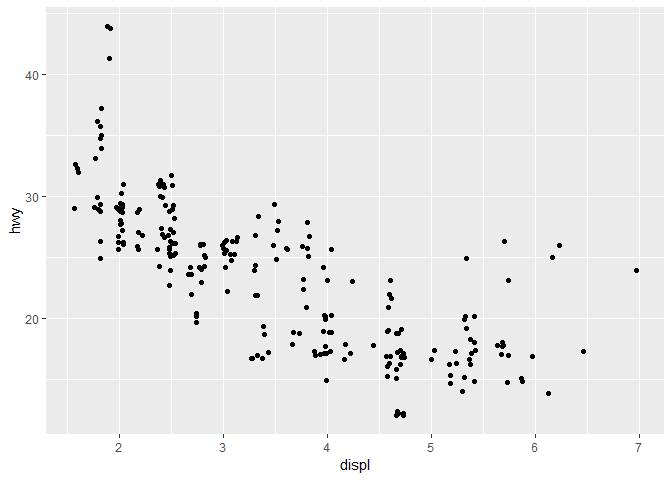

## Introduction

This week we will begin to work with one of the core packages of the `tidyverse` suite. Whenever we begin a new R session, we will need to "call" any libraries that we need to use. Because `ggplot2`, the data visualization package that we will use, is a part of `tidyverse` we can just call the entire `tidyverse` suite. If the following code does not work, then it is probably because you do not have `tidyverse` installed and you will need to begin with that step. 


```r
library(tidyverse)
```

```
## ── Attaching packages ─────────────────────────────────────────────────── tidyverse 1.2.1 ──
```

```
## ✔ ggplot2 2.2.1     ✔ purrr   0.2.4
## ✔ tibble  1.4.2     ✔ dplyr   0.7.4
## ✔ tidyr   0.8.0     ✔ stringr 1.3.1
## ✔ readr   1.1.1     ✔ forcats 0.3.0
```

```
## ── Conflicts ────────────────────────────────────────────────────── tidyverse_conflicts() ──
## ✖ dplyr::filter() masks stats::filter()
## ✖ dplyr::lag()    masks stats::lag()
```

```r
##in case you do not have this installed, uncomment following line and install
#install.packages("tidyverse")
#library(tidyverse)
```

Notice that the output indicates what packages are attached and also indicates whether there are any conflicts with other packages (this will be important later).

Let's play with one of the sample datasets that is included in ggplot2.

```r
mpg
```

```
## # A tibble: 234 x 11
##    manufacturer model    displ  year   cyl trans   drv     cty   hwy fl   
##    <chr>        <chr>    <dbl> <int> <int> <chr>   <chr> <int> <int> <chr>
##  1 audi         a4         1.8  1999     4 auto(l… f        18    29 p    
##  2 audi         a4         1.8  1999     4 manual… f        21    29 p    
##  3 audi         a4         2    2008     4 manual… f        20    31 p    
##  4 audi         a4         2    2008     4 auto(a… f        21    30 p    
##  5 audi         a4         2.8  1999     6 auto(l… f        16    26 p    
##  6 audi         a4         2.8  1999     6 manual… f        18    26 p    
##  7 audi         a4         3.1  2008     6 auto(a… f        18    27 p    
##  8 audi         a4 quat…   1.8  1999     4 manual… 4        18    26 p    
##  9 audi         a4 quat…   1.8  1999     4 auto(l… 4        16    25 p    
## 10 audi         a4 quat…   2    2008     4 manual… 4        20    28 p    
## # ... with 224 more rows, and 1 more variable: class <chr>
```

```r
str(mpg)
```

```
## Classes 'tbl_df', 'tbl' and 'data.frame':	234 obs. of  11 variables:
##  $ manufacturer: chr  "audi" "audi" "audi" "audi" ...
##  $ model       : chr  "a4" "a4" "a4" "a4" ...
##  $ displ       : num  1.8 1.8 2 2 2.8 2.8 3.1 1.8 1.8 2 ...
##  $ year        : int  1999 1999 2008 2008 1999 1999 2008 1999 1999 2008 ...
##  $ cyl         : int  4 4 4 4 6 6 6 4 4 4 ...
##  $ trans       : chr  "auto(l5)" "manual(m5)" "manual(m6)" "auto(av)" ...
##  $ drv         : chr  "f" "f" "f" "f" ...
##  $ cty         : int  18 21 20 21 16 18 18 18 16 20 ...
##  $ hwy         : int  29 29 31 30 26 26 27 26 25 28 ...
##  $ fl          : chr  "p" "p" "p" "p" ...
##  $ class       : chr  "compact" "compact" "compact" "compact" ...
```

We see that we have a data frame with 234 rows and 11 columns. The tidyverse uses a slightly different data frame structure than base R known as _tibbles_ we'll learn more about this in later chapters. Just know for now that it produces slightly different output.
What kinds of variables do we have?

Let's plot `displ` on the x-axis and `hwy` on the y-axis using a _scatterplot_.

```r
ggplot(data = mpg) +
  geom_point(mapping = aes(x = displ, y = hwy))
```

<!-- -->

Notice that the command consists of two elements. The first part indicates the data source and is contained withing the `ggplot()` command. Also note that the command name is `ggplot()` even though the package is `ggplot2`. Second, notice that we ended the first line with `+` and then continued with an indented second line. This is a formatting style that makes code easier to read, especially when we have long sequences of code. The second element is a _geom_ and indicates what type of graph that we want. Notice that we indicate the _aesthetics_ within this layer (but it can also be at top layer) and that we have plotted 2 positions, x- and y-axis. 

Generally speaking, `ggplot2` commands work on a _grammar of graphics_ and have a template:

> `ggplot(data = DATA) +
>
>  GEOM_FUNCTION(mapping = aes(MAPPINGS))`

There is a catalog of aesthetics from which to choose from. An excellent resource is the ggplot2 documentation page as well as a cheatsheet.

* [ggplot2 documentation][https://ggplot2.tidyverse.org/reference/]
* [ggplot2 cheatsheet][https://github.com/rstudio/cheatsheets/blob/master/data-visualization-2.1.pdf]

Playing with the same dataset, let's map a 3rd variable, `class` to color. 


```r
ggplot(data = mpg) +
  geom_point(mapping = aes(x = displ, y = hwy, color = class))
```

<!-- -->

Notice that a legend is created for the 3rd variable and we can easily distinguish subgroups within our data. Make sure that the aesthetic that you are choosing makes sense with your data. 


```r
ggplot(data = mpg) +
  geom_point(mapping = aes(x = class, y = hwy, color = displ))
```

<!-- -->

`ggplot2` cannot help you decide what graphs to produce, it will just attempt to graph what you ask it to. Sometimes the specific aesthetic may also create problems.


```r
ggplot(data = mpg) +
  geom_point(mapping = aes(x = displ, y = hwy, size = class))
```

```
## Warning: Using size for a discrete variable is not advised.
```

<!-- -->

Here, we get a warning, and we see that it is very hard to visualize the trends in the data. 

Some other mapping options include _shape_, _alpha_ (for transparency), _linetype_, _linewidth_. 


```r
ggplot(data = mpg) +
  geom_point(mapping = aes(x = displ, y = hwy, alpha = class))
```

<!-- -->

```r
ggplot(data = mpg) +
  geom_point(mapping = aes(x = displ, y = hwy, shape = class))
```

```
## Warning: The shape palette can deal with a maximum of 6 discrete values
## because more than 6 becomes difficult to discriminate; you have 7.
## Consider specifying shapes manually if you must have them.
```

```
## Warning: Removed 62 rows containing missing values (geom_point).
```

<!-- -->

### Facets
Faaceting can be useful to display subsets of your data rather than having everying jumbled onto one figure. Use `facet_wrap()` for adding one faceting variable and `facet_grid()` for more than one variable. In this case, we will need to use the `~` operator (formula in R speak) within the command.


```r
ggplot(data = mpg) +
  geom_point(mapping = aes(x = displ, y = hwy)) +
  facet_wrap(~ class) #notice nothing goes before ~
```

<!-- -->

```r
ggplot(data = mpg) +
  geom_point(mapping = aes(x = displ, y = hwy)) +
  facet_grid(drv ~ cyl) #notice we now have two variables separated by ~
```

<!-- -->

### Geometric Objects (geoms)

As we can see on the [ggplot2 documentation][https://ggplot2.tidyverse.org/reference/] there are a lot of options for different _geoms_ consider what type of variable you have. [Table 2.1][https://serialmentor.com/dataviz/aesthetic-mapping.html] of the _Fundamentals of Data Visualization_ e-book is a good reference for your consideration. Make sure you consider whether your data is continuous or discrete and if discrete, whether its ordered or unordered. 

Follow the book, let's plot using `geom_smooth()` which produces a line with a confidence band.


```r
ggplot(data = mpg) +
  geom_smooth(mapping = aes(x = displ, y = hwy))
```

```
## `geom_smooth()` using method = 'loess'
```

<!-- -->

We can also layer different _geoms_ onto the same graph (this is powerful).


```r
ggplot(data = mpg) +
  geom_point(mapping = aes(x = displ, y = hwy, color = drv)) +
  geom_smooth(mapping = aes(x = displ, y = hwy, linetype = drv))
```

```
## `geom_smooth()` using method = 'loess'
```

<!-- -->

Notice that if we are using (nearly) the same mapping, we can actually specify this at the top layer.


```r
ggplot(data = mpg, aes(x = displ, y = hwy)) +
  geom_point(aes(color = class)) +
  geom_smooth()
```

```
## `geom_smooth()` using method = 'loess'
```

<!-- -->

### Statistical Transformations (_stats_)

Sometimes we have to aggregate our data in some format to get the figure that we want (think plotting the _mean_ value of some level) or we want the figure to represent some statistical transformation (think _histograms_). To plot a histogram, we can just use `geom_bar()`. Notice that we really only need one variable now because R will now _count_ the data for us:

```r
head(diamonds)
```

```
## # A tibble: 6 x 10
##   carat cut       color clarity depth table price     x     y     z
##   <dbl> <ord>     <ord> <ord>   <dbl> <dbl> <int> <dbl> <dbl> <dbl>
## 1 0.23  Ideal     E     SI2      61.5    55   326  3.95  3.98  2.43
## 2 0.21  Premium   E     SI1      59.8    61   326  3.89  3.84  2.31
## 3 0.23  Good      E     VS1      56.9    65   327  4.05  4.07  2.31
## 4 0.290 Premium   I     VS2      62.4    58   334  4.2   4.23  2.63
## 5 0.31  Good      J     SI2      63.3    58   335  4.34  4.35  2.75
## 6 0.24  Very Good J     VVS2     62.8    57   336  3.94  3.96  2.48
```

```r
ggplot(data = diamonds) +
  geom_bar(aes(x = cut))
```

<!-- -->

3 classes of graphs are mentioned in Chapter 1:

* __bar charts, histograms, and frequency polygons__, which bin data and plot counts (or density/proportions) for each bin
* __smoothers__ fit a model to the data and plot predictions from model
* __boxplots__ and error barscompute summary statistics of distribution, mean/median, and outliers


```r
ggplot(diamonds, aes(x = cut, y = carat)) +
  geom_boxplot()
```

<!-- -->

`ggplot2` can also compute summary statistics, and this is a call that I use a lot, because we often want to plot the mean of some category.


```r
ggplot(data = diamonds, aes(x = cut, y = price)) +
  stat_summary(fun.y = mean, geom = "point")
```

<!-- -->

For now, it will in most cases be perfectly fine to work with default graphs, but down the line, you will want to adjust certain aspects/details. `ggplot2` allows you to do this, and it does require some effort at first. Just to give an indication, here we will play with position and barcharts. 

First, notice that the aesthetic for different grouping variables can be _color_ (as before, but this is actually not so helpful) or _fill_ (which is more helpful). 


```r
ggplot(data = diamonds, aes(x = cut, color = cut)) +
  geom_bar()
```

<!-- -->

```r
ggplot(data = diamonds, aes(x = cut, fill = cut)) +
  geom_bar()
```

<!-- -->

Notice that we are using the two different aesthetics for the same variable, so it's not so helpful, but we can map it to a different variable. The default action is to produce a stacked barplot.


```r
ggplot(diamonds, aes(x = cut, fill = clarity)) +
  geom_bar()
```

<!-- -->

For the most part, following what is typical in our field, we'll want to produced dodged bars. 


```r
ggplot(diamonds, aes(x = cut, fill = clarity)) +
  geom_bar(position = "dodge")
```

<!-- -->

Similarly, we can adjust overplotting of points by using the jitter option with `geom_point()`.


```r
ggplot(mpg, aes(x = displ, y = hwy)) +
  geom_point(position = "jitter")
```

<!-- -->

```r
#default
ggplot(mpg, aes(x = displ, y = hwy)) +
  geom_point()
```

<!-- -->

