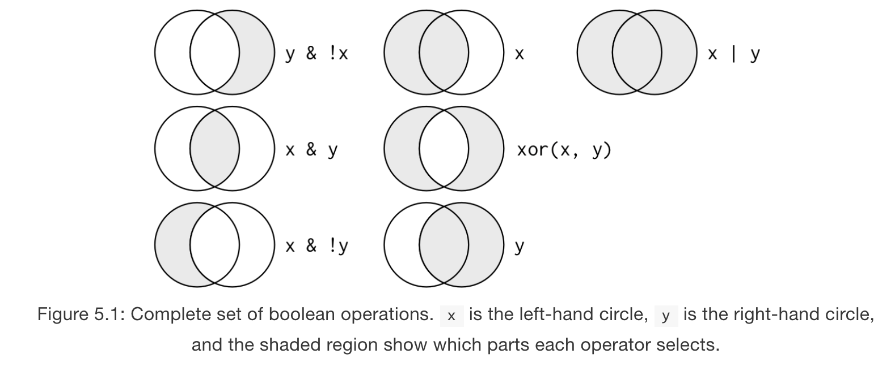

# Introduction

These notes are primarily built from Chapter 5 in _R for Data Science_ as well as some great slides found [here](https://ismayc.github.io/talks/ness-infer/slide_deck.html#1).

Last week we worked on data visualization, and we learned that `ggplot2` works with a _grammar of graphics_ where we first specify a data source (and potentially global aesthetics) and then "layer" each geometric object, facetting, statistical transormation, or other options. As long as we have our working directory set to our class folder, then we should be able to generate the following graph once we have imported our data (I'm going to hide the ggplot code to test whether you can reproduce this graph).

```{r import}
library(tidyverse)
cs_data <- read.csv("data/CSLex_Subset.csv")
head(cs_data)
```

And now a graph:
```{r graph, echo=FALSE}
ggplot(data = cs_data, aes(x = Time.100, y = Target, color = Gender)) +
  geom_point() +
  geom_smooth(aes(linetype = Type)) +
  facet_wrap(~Birth)
```

The code for the above plot is:

```{r graph code, eval=FALSE}
ggplot(data = cs_data, aes(x = Time.100, y = Target, color = Gender)) + #data source and global aesthetics
  geom_point() + #add scatterplot
  geom_smooth(aes(linetype = Type)) + #add predictor and linetype aesthetic
  facet_wrap(~Birth) #facet by Birth
```

However, the data had to be in the right format in order for the graph command to work. Rarely is this the case. We might have to:

* filter/sort our data
* change the order of rows
* pick certain variables to include
* create new variables
* summarize our values
* collapse multiple columns into one or split one into multiple columns

All of the above steps are common transformations. This week we'll focus on the first 5 (the 6th we'll work on in a different week) using hte `dplyr` package, which is included in the `tidyverse`. The above actions can be rewritten as `dplyr` functions:

* `filter()` picks observations by their values
* `arrange()` reorders rows
* `select()` picks variables (columns) by their names
* `mutate()` can create new variables 
* `summarize()` summarizes multiple values into singular ones

Often times, we will want to combine these actions with a grouping function, which in `tidyverse` is the `group_by()` command. Think of these functions as verbs with a similar argument structure. First, you'll **specify a dataset**, then you will **perform the action on a set of arguments**, and the action will **return a new dataset**. These functions can be chained together. 

I consider this package to be a **core** feature of the power of the `tidyverse` and R Studio in helping young researchers become independent. Think of filtering, sorting, and pivot tables (all functions in Excel) on steroids. 

## `filter()`

During our first week, we learned two ways of subsetting data: 1) the indexing method and 2) the `subset()` function. This will be a newer, simpler way to do it. First, just to make our code output easier to manage, we are going to coerce our data frame into a _tibble_. Remember this is a special kind of data frame that is used in the `tidyverse`. We will learn much more about tibbles in a couple of weeks but for now, it's usefult to know that it only prints the first 10 rows of data instead of the entire dataset. 

```{r tibble}
cs_lex <- as_tibble(cs_data)
cs_lex
```

With `filter()`, the first argument is the dataset and the next arguments are the conditionals by which you want to filter the data. We can for example only look at participants born in the US.

```{r US birth}
filter(cs_lex, Birth == "US")
```

We can combine and filter by US birth as well as only feminine conditions.

```{r US and fem}
filter(cs_lex, Birth == "US", Gender == "Feminine")
```

### Comparisons
This function makes life easy if we want to select specific values but sometimes we need to add different kinds of comparison operators. Just remember that some of the comparisons require numbers (`>, <, <=, >=`), and always remember: **`==` is for values where `=` is for arguments**. We also have a special symbol for _not equals_: `!=`. 

```{r comparison}
filter(cs_lex, Time.100 > 350)
```
```{r not}
filter(cs_lex, Gender != "Feminine")
```

### Logical Operators
There are several **Boolean** operators that we can use to combine with our conditions. If we only use the comma to separate conditions, then the operation is implicity "and". This figure from the chapter is really helpful for visualizing the logical operators. 




There are usually multiple ways to write filtering conditions with these locial operators. For example, we could get _Control_ and _Match_ conditions and not grab _Filler_ by either of these methods:

```{r not Filler}
filter(cs_lex, Type != "Filler")
```
```{r or method}
filter(cs_lex, Type == "Control" | Type == "Match")
```

## `arrange()`
Instead of selecting rows based on a set of conditions, `arrange()` changes the order of rows. We can rearrange by multiple columns, in which case the order of the columns will determine the weight of ordering (like with custom sort in Excel).

```{r arrange}
arrange(cs_lex, Time.100, Subject)
```

We can use a special argument function if we want to instead present by descending order:
```{r descending}
arrange(cs_lex, desc(Condition))
```

### `select()`

Sometimes the data source that we get is massive and we may need to _select_ o _remove_ some columns to help us process our data. Our dataset is not huge, but we can still get the general idea. 

```{r select}
select(cs_lex, Subject, Gender, Type, Time.100, Target)
```

We can do this with the `:` operator which roughly translates to "through".

```{r through}
select(cs_lex, Subject:Type)
```

We can deselect by using `-` and specifying column names.

```{r deselect}
select(cs_lex, -(Subject:Type))
```

There are also several additional functions that work with pattern matching. 

### `mutate()` and `summarize()`

These last two verbs are extremely powerful, and I use them quite a bit. They can be somewhat confusable. `mutate()` adds new columns to your existing dataset whereas `summarize()` creates a new dataset with a reduced number of rows. One of the really great things about `mutate()` is that you can create new columns (i.e., variables) that are built off of existing or even newly created variables. With both of these functions, since we are specifying new variables, we will need to create new variables within the function. 

```{r mutate}
cs_lex2 <- select(cs_lex, -(Subject:Time.100))
mutate(cs_lex2, Target_Proportion = Target/(Target+Distractor+Other+Saccade+Track_Loss))
```

```{r new variables}
mutate(cs_lex2, Target_Prop = Target/Bins, Target_Percent = Target_Prop*100)
```

With `summarize()`, we are aggregating data. This will often need to be done with `group_by()` which indicates what variables the data is being aggregated over. Let's say that we want to know the mean Target fixation grouped by Birth and Time.
```{r}
by_group_time <- group_by(cs_lex, Birth, Time.100)
summarize(by_group_time, Target_group = mean(Target))
```

It gets cumbersome to have to create new variables in order to carry yout differnt actions. Instead, we can string several functions together withe pipe operator, `%>%`, which has its own shortcut key **CTRL/CMD + SHIFT + m**. This operator should be read as "and then". It takes some getting used to but it greatly simplifies code.

```{r pipe 1}
cs_lex %>% 
  group_by(Birth, Gender, Type, Time.100) %>% 
  summarize(Mean_Target = mean(Target), Mean_Distractor = mean(Distractor))
```

We can also use several other summarizing functions. `n()` has become an indispensable function for me becuase it counts the number of rows that one has while summarizing which is useful for making sure that you have balanced data.

```{r}
cs_lex %>% 
  group_by(Subject, Condition) %>% 
  summarize(Count = n())
```

And now we can begin to combine elements together to get more meaningful graphs. 

```{r}
cs_exp <- cs_lex %>% 
  filter(Birth != "Other", Type != "Filler") %>% 
  group_by(Birth, Time.100, Gender, Type) %>% 
  summarize(Target = mean(Target))
ggplot(cs_exp, aes(x = Time.100, y = Target, color = Gender)) +
  geom_point() +
  geom_smooth(aes(linetype = Type)) +
  facet_wrap(~Birth)
```

