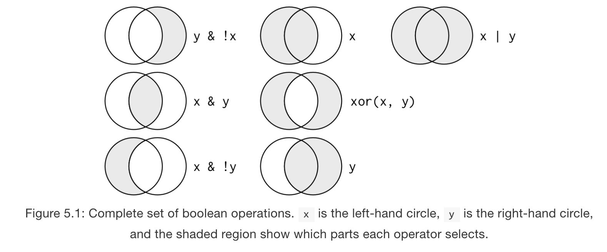

# Introduction

These notes are primarily built from Chapter 5 in _R for Data Science_ as well as some great slides found [here](https://ismayc.github.io/talks/ness-infer/slide_deck.html#1).

Last week we worked on data visualization, and we learned that `ggplot2` works with a _grammar of graphics_ where we first specify a data source (and potentially global aesthetics) and then "layer" each geometric object, facetting, statistical transormation, or other options. As long as we have our working directory set to our class folder, then we should be able to generate the following graph once we have imported our data (I'm going to hide the ggplot code to test whether you can reproduce this graph).


```r
library(tidyverse)
```

```
## ── Attaching packages ────────────────────────────────────────────────────────────────────────────── tidyverse 1.2.1 ──
```

```
## ✔ ggplot2 2.2.1     ✔ purrr   0.2.4
## ✔ tibble  1.4.2     ✔ dplyr   0.7.4
## ✔ tidyr   0.8.0     ✔ stringr 1.3.1
## ✔ readr   1.1.1     ✔ forcats 0.3.0
```

```
## ── Conflicts ───────────────────────────────────────────────────────────────────────────────── tidyverse_conflicts() ──
## ✖ dplyr::filter() masks stats::filter()
## ✖ dplyr::lag()    masks stats::lag()
```

```r
cs_data <- read.csv("data/CSLex_Subset.csv")
head(cs_data)
```

```
##   Subject Condition   Gender    Type Birth Time.100 Target Distractor
## 1      15         1 Feminine Control Latin       50    364        233
## 2      15         1 Feminine Control Latin      150    336        267
## 3      15         1 Feminine Control Latin      250    507         70
## 4      15         1 Feminine Control Latin      350    597        182
## 5      15         1 Feminine Control Latin      450    615        286
## 6      15         1 Feminine Control Latin      550    657        263
##   Other Saccade Track_Loss Bins
## 1   174     161         68 1000
## 2   207     177         13 1000
## 3   228     101         94 1000
## 4    84     137          0 1000
## 5    24      75          0 1000
## 6     0      80          0 1000
```

And now a graph:

```
## `geom_smooth()` using method = 'loess'
```

<!-- -->

The code for the above plot is:


```r
ggplot(data = cs_data, aes(x = Time.100, y = Target, color = Gender)) + #data source and global aesthetics
  geom_point() + #add scatterplot
  geom_smooth(aes(linetype = Type)) + #add predictor and linetype aesthetic
  facet_wrap(~Birth) #facet by Birth
```

However, the data had to be in the right format in order for the graph command to work. Rarely is this the case. We might have to:

* filter/sort our data
* change the order of rows
* pick certain variables to include
* create new variables
* summarize our values
* collapse multiple columns into one or split one into multiple columns

All of the above steps are common transformations. This week we'll focus on the first 5 (the 6th we'll work on in a different week) using hte `dplyr` package, which is included in the `tidyverse`. The above actions can be rewritten as `dplyr` functions:

* `filter()` picks observations by their values
* `arrange()` reorders rows
* `select()` picks variables (columns) by their names
* `mutate()` can create new variables 
* `summarize()` summarizes multiple values into singular ones

Often times, we will want to combine these actions with a grouping function, which in `tidyverse` is the `group_by()` command. Think of these functions as verbs with a similar argument structure. First, you'll **specify a dataset**, then you will **perform the action on a set of arguments**, and the action will **return a new dataset**. These functions can be chained together. 

I consider this package to be a **core** feature of the power of the `tidyverse` and R Studio in helping young researchers become independent. Think of filtering, sorting, and pivot tables (all functions in Excel) on steroids. 

## `filter()`

During our first week, we learned two ways of subsetting data: 1) the indexing method and 2) the `subset()` function. This will be a newer, simpler way to do it. First, just to make our code output easier to manage, we are going to coerce our data frame into a _tibble_. Remember this is a special kind of data frame that is used in the `tidyverse`. We will learn much more about tibbles in a couple of weeks but for now, it's usefult to know that it only prints the first 10 rows of data instead of the entire dataset. 


```r
cs_lex <- as_tibble(cs_data)
cs_lex
```

```
## # A tibble: 1,344 x 12
##    Subject Condition Gender  Type   Birth Time.100 Target Distractor Other
##      <int>     <int> <fct>   <fct>  <fct>    <int>  <int>      <int> <int>
##  1      15         1 Femini… Contr… Latin       50    364        233   174
##  2      15         1 Femini… Contr… Latin      150    336        267   207
##  3      15         1 Femini… Contr… Latin      250    507         70   228
##  4      15         1 Femini… Contr… Latin      350    597        182    84
##  5      15         1 Femini… Contr… Latin      450    615        286    24
##  6      15         1 Femini… Contr… Latin      550    657        263     0
##  7      15         1 Femini… Contr… Latin      650    719         29    46
##  8      15         1 Femini… Contr… Latin      750    802          0   100
##  9      15         2 Femini… Match  Latin       50    295        269   280
## 10      15         2 Femini… Match  Latin      150    400        283   281
## # ... with 1,334 more rows, and 3 more variables: Saccade <int>,
## #   Track_Loss <int>, Bins <int>
```

With `filter()`, the first argument is the dataset and the next arguments are the conditionals by which you want to filter the data. We can for example only look at participants born in the US.


```r
filter(cs_lex, Birth == "US")
```

```
## # A tibble: 480 x 12
##    Subject Condition Gender  Type   Birth Time.100 Target Distractor Other
##      <int>     <int> <fct>   <fct>  <fct>    <int>  <int>      <int> <int>
##  1      54         1 Femini… Contr… US          50    371        455   121
##  2      54         1 Femini… Contr… US         150    400        400   200
##  3      54         1 Femini… Contr… US         250    538        241    60
##  4      54         1 Femini… Contr… US         350    762         82    63
##  5      54         1 Femini… Contr… US         450    771         93    41
##  6      54         1 Femini… Contr… US         550    896          0     0
##  7      54         1 Femini… Contr… US         650    978          0     0
##  8      54         1 Femini… Contr… US         750    973          0     0
##  9      54         2 Femini… Match  US          50    100        630    76
## 10      54         2 Femini… Match  US         150    237        560    64
## # ... with 470 more rows, and 3 more variables: Saccade <int>,
## #   Track_Loss <int>, Bins <int>
```

We can combine and filter by US birth as well as only feminine conditions.


```r
filter(cs_lex, Birth == "US", Gender == "Feminine")
```

```
## # A tibble: 240 x 12
##    Subject Condition Gender  Type   Birth Time.100 Target Distractor Other
##      <int>     <int> <fct>   <fct>  <fct>    <int>  <int>      <int> <int>
##  1      54         1 Femini… Contr… US          50    371        455   121
##  2      54         1 Femini… Contr… US         150    400        400   200
##  3      54         1 Femini… Contr… US         250    538        241    60
##  4      54         1 Femini… Contr… US         350    762         82    63
##  5      54         1 Femini… Contr… US         450    771         93    41
##  6      54         1 Femini… Contr… US         550    896          0     0
##  7      54         1 Femini… Contr… US         650    978          0     0
##  8      54         1 Femini… Contr… US         750    973          0     0
##  9      54         2 Femini… Match  US          50    100        630    76
## 10      54         2 Femini… Match  US         150    237        560    64
## # ... with 230 more rows, and 3 more variables: Saccade <int>,
## #   Track_Loss <int>, Bins <int>
```

### Comparisons
This function makes life easy if we want to select specific values but sometimes we need to add different kinds of comparison operators. Just remember that some of the comparisons require numbers (`>, <, <=, >=`), and always remember: **`==` is for values where `=` is for arguments**. We also have a special symbol for _not equals_: `!=`. 


```r
filter(cs_lex, Time.100 > 350)
```

```
## # A tibble: 672 x 12
##    Subject Condition Gender   Type  Birth Time.100 Target Distractor Other
##      <int>     <int> <fct>    <fct> <fct>    <int>  <int>      <int> <int>
##  1      15         1 Feminine Cont… Latin      450    615        286    24
##  2      15         1 Feminine Cont… Latin      550    657        263     0
##  3      15         1 Feminine Cont… Latin      650    719         29    46
##  4      15         1 Feminine Cont… Latin      750    802          0   100
##  5      15         2 Feminine Match Latin      450    283         81   445
##  6      15         2 Feminine Match Latin      550    372         34   438
##  7      15         2 Feminine Match Latin      650    562          0   321
##  8      15         2 Feminine Match Latin      750    636          0   259
##  9      15         4 Masculi… Cont… Latin      450    300        250   400
## 10      15         4 Masculi… Cont… Latin      550    339         71   433
## # ... with 662 more rows, and 3 more variables: Saccade <int>,
## #   Track_Loss <int>, Bins <int>
```

```r
filter(cs_lex, Gender != "Feminine")
```

```
## # A tibble: 672 x 12
##    Subject Condition Gender   Type  Birth Time.100 Target Distractor Other
##      <int>     <int> <fct>    <fct> <fct>    <int>  <int>      <int> <int>
##  1      15         4 Masculi… Cont… Latin       50    232        333   175
##  2      15         4 Masculi… Cont… Latin      150    400        358   205
##  3      15         4 Masculi… Cont… Latin      250    376        299   126
##  4      15         4 Masculi… Cont… Latin      350    286        347   246
##  5      15         4 Masculi… Cont… Latin      450    300        250   400
##  6      15         4 Masculi… Cont… Latin      550    339         71   433
##  7      15         4 Masculi… Cont… Latin      650    547         91   280
##  8      15         4 Masculi… Cont… Latin      750    729        100    76
##  9      15         5 Masculi… Match Latin       50    223        617     0
## 10      15         5 Masculi… Match Latin      150    332        548     0
## # ... with 662 more rows, and 3 more variables: Saccade <int>,
## #   Track_Loss <int>, Bins <int>
```

### Logical Operators
There are several **Boolean** operators that we can use to combine with our conditions. If we only use the comma to separate conditions, then the operation is implicity "and". This figure from the chapter is really helpful for visualizing the logical operators. 




There are usually multiple ways to write filtering conditions with these locial operators. For example, we could get _Control_ and _Match_ conditions and not grab _Filler_ by either of these methods:


```r
filter(cs_lex, Type != "Filler")
```

```
## # A tibble: 896 x 12
##    Subject Condition Gender  Type   Birth Time.100 Target Distractor Other
##      <int>     <int> <fct>   <fct>  <fct>    <int>  <int>      <int> <int>
##  1      15         1 Femini… Contr… Latin       50    364        233   174
##  2      15         1 Femini… Contr… Latin      150    336        267   207
##  3      15         1 Femini… Contr… Latin      250    507         70   228
##  4      15         1 Femini… Contr… Latin      350    597        182    84
##  5      15         1 Femini… Contr… Latin      450    615        286    24
##  6      15         1 Femini… Contr… Latin      550    657        263     0
##  7      15         1 Femini… Contr… Latin      650    719         29    46
##  8      15         1 Femini… Contr… Latin      750    802          0   100
##  9      15         2 Femini… Match  Latin       50    295        269   280
## 10      15         2 Femini… Match  Latin      150    400        283   281
## # ... with 886 more rows, and 3 more variables: Saccade <int>,
## #   Track_Loss <int>, Bins <int>
```

```r
filter(cs_lex, Type == "Control" | Type == "Match")
```

```
## # A tibble: 896 x 12
##    Subject Condition Gender  Type   Birth Time.100 Target Distractor Other
##      <int>     <int> <fct>   <fct>  <fct>    <int>  <int>      <int> <int>
##  1      15         1 Femini… Contr… Latin       50    364        233   174
##  2      15         1 Femini… Contr… Latin      150    336        267   207
##  3      15         1 Femini… Contr… Latin      250    507         70   228
##  4      15         1 Femini… Contr… Latin      350    597        182    84
##  5      15         1 Femini… Contr… Latin      450    615        286    24
##  6      15         1 Femini… Contr… Latin      550    657        263     0
##  7      15         1 Femini… Contr… Latin      650    719         29    46
##  8      15         1 Femini… Contr… Latin      750    802          0   100
##  9      15         2 Femini… Match  Latin       50    295        269   280
## 10      15         2 Femini… Match  Latin      150    400        283   281
## # ... with 886 more rows, and 3 more variables: Saccade <int>,
## #   Track_Loss <int>, Bins <int>
```

## `arrange()`
Instead of selecting rows based on a set of conditions, `arrange()` changes the order of rows. We can rearrange by multiple columns, in which case the order of the columns will determine the weight of ordering (like with custom sort in Excel).


```r
arrange(cs_lex, Time.100, Subject)
```

```
## # A tibble: 1,344 x 12
##    Subject Condition Gender   Type  Birth Time.100 Target Distractor Other
##      <int>     <int> <fct>    <fct> <fct>    <int>  <int>      <int> <int>
##  1       3         1 Feminine Cont… US          50    300        254   292
##  2       3         2 Feminine Match US          50    127        684   100
##  3       3         4 Masculi… Cont… US          50    300        500   170
##  4       3         5 Masculi… Match US          50    317        456   176
##  5       3         7 Feminine Fill… US          50   1453        847   478
##  6       3         8 Masculi… Fill… US          50   1228        937   642
##  7       6         1 Feminine Cont… Latin       50      0        726   195
##  8       6         2 Feminine Match Latin       50    600        372     0
##  9       6         4 Masculi… Cont… Latin       50    565        279     0
## 10       6         5 Masculi… Match Latin       50    687        288     0
## # ... with 1,334 more rows, and 3 more variables: Saccade <int>,
## #   Track_Loss <int>, Bins <int>
```

We can use a special argument function if we want to instead present by descending order:

```r
arrange(cs_lex, desc(Condition))
```

```
## # A tibble: 1,344 x 12
##    Subject Condition Gender   Type  Birth Time.100 Target Distractor Other
##      <int>     <int> <fct>    <fct> <fct>    <int>  <int>      <int> <int>
##  1      15         8 Masculi… Fill… Latin       50    853       1243   540
##  2      15         8 Masculi… Fill… Latin      150    877       1149   565
##  3      15         8 Masculi… Fill… Latin      250    957        862   929
##  4      15         8 Masculi… Fill… Latin      350   1028        678   920
##  5      15         8 Masculi… Fill… Latin      450   1451        522   672
##  6      15         8 Masculi… Fill… Latin      550   2089        128   468
##  7      15         8 Masculi… Fill… Latin      650   2352         72   349
##  8      15         8 Masculi… Fill… Latin      750   2578          0    88
##  9      20         8 Masculi… Fill… Latin       50   1338       1046   103
## 10      20         8 Masculi… Fill… Latin      150   1393       1154    86
## # ... with 1,334 more rows, and 3 more variables: Saccade <int>,
## #   Track_Loss <int>, Bins <int>
```

### `select()`

Sometimes the data source that we get is massive and we may need to _select_ o _remove_ some columns to help us process our data. Our dataset is not huge, but we can still get the general idea. 


```r
select(cs_lex, Subject, Gender, Type, Time.100, Target)
```

```
## # A tibble: 1,344 x 5
##    Subject Gender   Type    Time.100 Target
##      <int> <fct>    <fct>      <int>  <int>
##  1      15 Feminine Control       50    364
##  2      15 Feminine Control      150    336
##  3      15 Feminine Control      250    507
##  4      15 Feminine Control      350    597
##  5      15 Feminine Control      450    615
##  6      15 Feminine Control      550    657
##  7      15 Feminine Control      650    719
##  8      15 Feminine Control      750    802
##  9      15 Feminine Match         50    295
## 10      15 Feminine Match        150    400
## # ... with 1,334 more rows
```

We can do this with the `:` operator which roughly translates to "through".


```r
select(cs_lex, Subject:Type)
```

```
## # A tibble: 1,344 x 4
##    Subject Condition Gender   Type   
##      <int>     <int> <fct>    <fct>  
##  1      15         1 Feminine Control
##  2      15         1 Feminine Control
##  3      15         1 Feminine Control
##  4      15         1 Feminine Control
##  5      15         1 Feminine Control
##  6      15         1 Feminine Control
##  7      15         1 Feminine Control
##  8      15         1 Feminine Control
##  9      15         2 Feminine Match  
## 10      15         2 Feminine Match  
## # ... with 1,334 more rows
```

We can deselect by using `-` and specifying column names.


```r
select(cs_lex, -(Subject:Type))
```

```
## # A tibble: 1,344 x 8
##    Birth Time.100 Target Distractor Other Saccade Track_Loss  Bins
##    <fct>    <int>  <int>      <int> <int>   <int>      <int> <int>
##  1 Latin       50    364        233   174     161         68  1000
##  2 Latin      150    336        267   207     177         13  1000
##  3 Latin      250    507         70   228     101         94  1000
##  4 Latin      350    597        182    84     137          0  1000
##  5 Latin      450    615        286    24      75          0  1000
##  6 Latin      550    657        263     0      80          0  1000
##  7 Latin      650    719         29    46     173         33  1000
##  8 Latin      750    802          0   100      42         56  1000
##  9 Latin       50    295        269   280     156          0  1000
## 10 Latin      150    400        283   281      36          0  1000
## # ... with 1,334 more rows
```

There are also several additional functions that work with pattern matching. 

### `mutate()` and `summarize()`

These last two verbs are extremely powerful, and I use them quite a bit. They can be somewhat confusable. `mutate()` adds new columns to your existing dataset whereas `summarize()` creates a new dataset with a reduced number of rows. One of the really great things about `mutate()` is that you can create new columns (i.e., variables) that are built off of existing or even newly created variables. With both of these functions, since we are specifying new variables, we will need to create new variables within the function. 


```r
cs_lex2 <- select(cs_lex, -(Subject:Time.100))
mutate(cs_lex2, Target_Proportion = Target/(Target+Distractor+Other+Saccade+Track_Loss))
```

```
## # A tibble: 1,344 x 7
##    Target Distractor Other Saccade Track_Loss  Bins Target_Proportion
##     <int>      <int> <int>   <int>      <int> <int>             <dbl>
##  1    364        233   174     161         68  1000             0.364
##  2    336        267   207     177         13  1000             0.336
##  3    507         70   228     101         94  1000             0.507
##  4    597        182    84     137          0  1000             0.597
##  5    615        286    24      75          0  1000             0.615
##  6    657        263     0      80          0  1000             0.657
##  7    719         29    46     173         33  1000             0.719
##  8    802          0   100      42         56  1000             0.802
##  9    295        269   280     156          0  1000             0.295
## 10    400        283   281      36          0  1000             0.4  
## # ... with 1,334 more rows
```


```r
mutate(cs_lex2, Target_Prop = Target/Bins, Target_Percent = Target_Prop*100)
```

```
## # A tibble: 1,344 x 8
##    Target Distractor Other Saccade Track_Loss  Bins Target_Prop
##     <int>      <int> <int>   <int>      <int> <int>       <dbl>
##  1    364        233   174     161         68  1000       0.364
##  2    336        267   207     177         13  1000       0.336
##  3    507         70   228     101         94  1000       0.507
##  4    597        182    84     137          0  1000       0.597
##  5    615        286    24      75          0  1000       0.615
##  6    657        263     0      80          0  1000       0.657
##  7    719         29    46     173         33  1000       0.719
##  8    802          0   100      42         56  1000       0.802
##  9    295        269   280     156          0  1000       0.295
## 10    400        283   281      36          0  1000       0.4  
## # ... with 1,334 more rows, and 1 more variable: Target_Percent <dbl>
```

With `summarize()`, we are aggregating data. This will often need to be done with `group_by()` which indicates what variables the data is being aggregated over. Let's say that we want to know the mean Target fixation grouped by Birth and Time.

```r
by_group_time <- group_by(cs_lex, Birth, Time.100)
summarize(by_group_time, Target_group = mean(Target))
```

```
## # A tibble: 24 x 3
## # Groups:   Birth [?]
##    Birth Time.100 Target_group
##    <fct>    <int>        <dbl>
##  1 Latin       50         618.
##  2 Latin      150         635.
##  3 Latin      250         664.
##  4 Latin      350         736.
##  5 Latin      450         860.
##  6 Latin      550        1029.
##  7 Latin      650        1181.
##  8 Latin      750        1302.
##  9 Other       50         609.
## 10 Other      150         625 
## # ... with 14 more rows
```

It gets cumbersome to have to create new variables in order to carry yout differnt actions. Instead, we can string several functions together withe pipe operator, `%>%`, which has its own shortcut key **CTRL/CMD + SHIFT + m**. This operator should be read as "and then". It takes some getting used to but it greatly simplifies code.


```r
cs_lex %>% 
  group_by(Birth, Gender, Type, Time.100) %>% 
  summarize(Mean_Target = mean(Target), Mean_Distractor = mean(Distractor))
```

```
## # A tibble: 144 x 6
## # Groups:   Birth, Gender, Type [?]
##    Birth Gender   Type    Time.100 Mean_Target Mean_Distractor
##    <fct> <fct>    <fct>      <int>       <dbl>           <dbl>
##  1 Latin Feminine Control       50        274.           368. 
##  2 Latin Feminine Control      150        314.           362. 
##  3 Latin Feminine Control      250        355.           320. 
##  4 Latin Feminine Control      350        432            306  
##  5 Latin Feminine Control      450        518.           282. 
##  6 Latin Feminine Control      550        629.           209. 
##  7 Latin Feminine Control      650        704.           146. 
##  8 Latin Feminine Control      750        789.            96.4
##  9 Latin Feminine Filler        50       1084.          1104. 
## 10 Latin Feminine Filler       150       1053.          1158. 
## # ... with 134 more rows
```

We can also use several other summarizing functions. `n()` has become an indispensable function for me becuase it counts the number of rows that one has while summarizing which is useful for making sure that you have balanced data.


```r
cs_lex %>% 
  group_by(Subject, Condition) %>% 
  summarize(Count = n())
```

```
## # A tibble: 168 x 3
## # Groups:   Subject [?]
##    Subject Condition Count
##      <int>     <int> <int>
##  1       3         1     8
##  2       3         2     8
##  3       3         4     8
##  4       3         5     8
##  5       3         7     8
##  6       3         8     8
##  7       6         1     8
##  8       6         2     8
##  9       6         4     8
## 10       6         5     8
## # ... with 158 more rows
```

And now we can begin to combine elements together to get more meaningful graphs. 


```r
cs_exp <- cs_lex %>% 
  filter(Birth != "Other", Type != "Filler") %>% 
  group_by(Birth, Time.100, Gender, Type) %>% 
  summarize(Target = mean(Target))
ggplot(cs_exp, aes(x = Time.100, y = Target, color = Gender)) +
  geom_point() +
  geom_smooth(aes(linetype = Type)) +
  facet_wrap(~Birth)
```

```
## `geom_smooth()` using method = 'loess'
```

<!-- -->

