# Introduction

The materials for this class are built off of Chapter 7, Exploratory Data Analysis from the _R for Data Science_ e-book (Chapter 5 in the physical book). In experimental research, we normally take a **confirmatory** approach, more or less following these steps:

1. Generate research questions
2. State hypotheses
3. Design study
4. Analyze data to test whether hypotheses are confirmed or not
5. Conduct follow-ups if necessary

In other instances, it may be worthwhile to conduct **exploratory** analyses. Under this approach, we use the data to generate new questions and to further explore patterns in the data. The following steps are thus iterative:

1. Generate new questions about your data
2. Explore your data by visualizing, transforming, and modeling your data
3. Use answers to the step above to refine and/or generate new questions

The above steps are also highly important to check for data quality in your initial analyses. We can use them to identify any _outliers_ in our dataset or to track down any errors that may have been introduced into the experimental design (mispelled words, wrong pictures, wrong coding scheme, etc.). It happens! 

As the chapter discusses, exploratory questions are a part of a creative process and through experience and exposure, you'll know what questions may be relevant for the method that you are using. There are, however, 2 classes of questions which are likely to be relevant (especially with human subjects data):

1. What type of variation occurs within my variables?
2. What type of covariation occurs between my variables? 

Defining some additional terms (p. 83 from physical book):

* _Variable_: a quantity, quality, or property that can be measured
* _Value_: the state of a variable when it is measured. This may change from measurement to measurement
* _Observation_ or _Case_: a set of measuresments made under similar conditions. An observation will normally have several values, each with different variables. 
* _Tabular data_: a set of values, each associated with a variable and an observation. Tabular data is _tidy_ if each value is placed in its own cell, each variable in its own column, and each observation in its own row. 

Up to now, we have mainly dealt with tidy data. This is usually not how the raw data looks. We will continue to work on getting data into tidy format. 

# Variation

Variation refers to how much the values of a variable changes from measurement to measurement. When you measure mutliple times, there is always some amount of error that can be included, which creates in differences in values. For our field specifically, we are utilizing repeated-measures designs where variation is a fundamental aspect of our measurements. We _know_ that only measuring a participant once would not be representative, so we make certain to get a number of mesaurements with variation already built in. There are several ways to visualize variation, with barplots/histograms and boxplots being amongst the most typical. 

## Setting up

Let's get started with some data. First, set your working directory to our class folder and set up the `tidyverse` package.


```r
library(tidyverse)
```

Let's take a closer look at the CS_Lex dataset:

```r
cs <- read_csv("data/CSLex_Subset.csv")
```

```
## Parsed with column specification:
## cols(
##   Subject = col_character(),
##   Condition = col_integer(),
##   Gender = col_character(),
##   Type = col_character(),
##   Birth = col_character(),
##   Time.100 = col_integer(),
##   Target = col_integer(),
##   Distractor = col_integer(),
##   Other = col_integer(),
##   Saccade = col_integer(),
##   Track_Loss = col_integer(),
##   Bins = col_integer()
## )
```

```r
glimpse(cs)
```

```
## Observations: 1,344
## Variables: 12
## $ Subject    <chr> "15", "15", "15", "15", "15", "15", "15", "15", "15...
## $ Condition  <int> 1, 1, 1, 1, 1, 1, 1, 1, 2, 2, 2, 2, 2, 2, 2, 2, 4, ...
## $ Gender     <chr> "Feminine", "Feminine", "Feminine", "Feminine", "Fe...
## $ Type       <chr> "Control", "Control", "Control", "Control", "Contro...
## $ Birth      <chr> "Latin", "Latin", "Latin", "Latin", "Latin", "Latin...
## $ Time.100   <int> 50, 150, 250, 350, 450, 550, 650, 750, 50, 150, 250...
## $ Target     <int> 364, 336, 507, 597, 615, 657, 719, 802, 295, 400, 3...
## $ Distractor <int> 233, 267, 70, 182, 286, 263, 29, 0, 269, 283, 263, ...
## $ Other      <int> 174, 207, 228, 84, 24, 0, 46, 100, 280, 281, 325, 4...
## $ Saccade    <int> 161, 177, 101, 137, 75, 80, 173, 42, 156, 36, 68, 4...
## $ Track_Loss <int> 68, 13, 94, 0, 0, 0, 33, 56, 0, 0, 0, 0, 0, 0, 0, 0...
## $ Bins       <int> 1000, 1000, 1000, 1000, 1000, 1000, 1000, 1000, 100...
```

Until now, I haven't given you much information on this data set (on purpose). But now I'm going to explain the structure of the datset. This datset is from a visual world eye-tracking study that consists of 12 variables with the following charactersists:

* Subject: a variable that identifies the participants
* Condition: a coding variable that identifies the unique conditions in the experiment (without respect to the experimental design). The unique values of this variable are `unique(cs$Condition)`
* Gender: a factor of interest that identifies whether the a trial included a masculine or feminine definite article
* Type: a factor of interest that identifies whether the trial was an experimental (match), control, or filler one
* Birth: a variable that identifies whether the participant was born in the US or in Latin America
* Time.100: a variable that identifies the time course of eye fixation data. It is an integer that starts at 50 and increases in increments of 100
* Target: a variable that indicates the number of looks to the target in any 100 ms increment
* Distractor: a variable that indicates the number of looks to the distractor in any 100 ms increment
* Other: a variable that indicates the number of looks to outside regions in any 100 ms increment
* Saccade: a variable that indicates the number of saccades (quick movements of the eye) in any 100 ms increment
* Track_Loss: a variable that indicates the number of blinks in any 100 ms increment
* Bins: a variable that adds up the number of data points in Target, Distractor, Other, Saccade, and Track_Loss per row

Is this data set tidy? Take 5 mins to discuss with your neighbors. 

## Distributions

How we visualize distributions will depend on whether a variable is categorical or continuous. For categorical variables, use a barplot.


```r
ggplot(cs, aes(x = Birth)) + geom_bar()
```

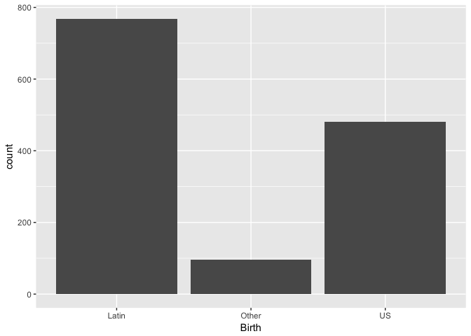<!-- -->

We see that we have more data from Latin-born participants, then US-born participants, and a few classified as "Other". We can also calculate these values using `count()`:


```r
cs %>% 
  count(Birth)
```

```
## # A tibble: 3 x 2
##   Birth     n
##   <chr> <int>
## 1 Latin   768
## 2 Other    96
## 3 US      480
```

We could also test to see if there are the same number of observations per participant.


```r
ggplot(cs, aes(x = Subject)) + geom_bar()
```

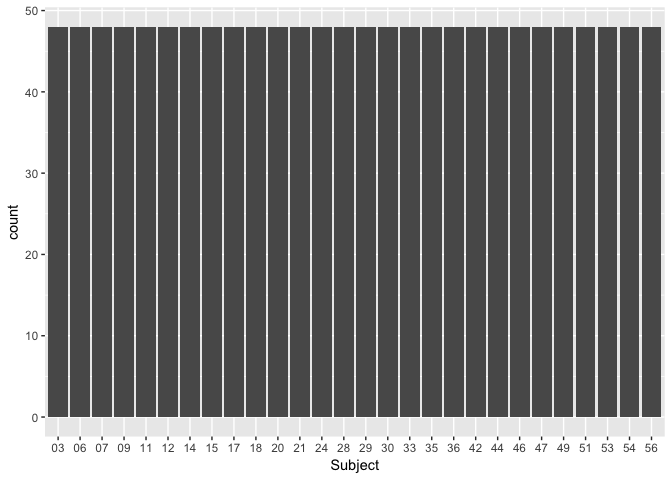<!-- -->

The bars are all equivalent height, indicating that all subjects contributed the same amount of data (good for quality check).

When dealing with a continuous variable, we would use a histogram instead, which arbitrarily bins the data. 


```r
ggplot(cs, aes(x = Target)) + geom_histogram()
```

```
## `stat_bin()` using `bins = 30`. Pick better value with `binwidth`.
```

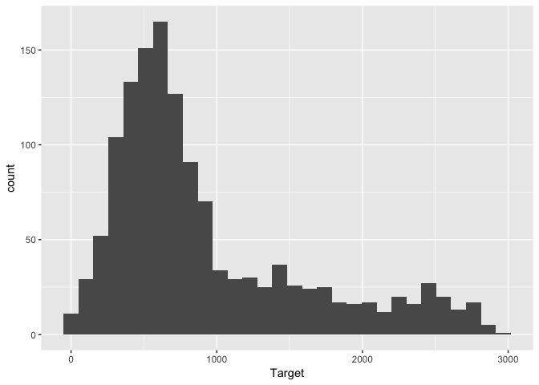<!-- -->

```r
ggplot(cs, aes(x = Distractor)) + geom_histogram()
```

```
## `stat_bin()` using `bins = 30`. Pick better value with `binwidth`.
```

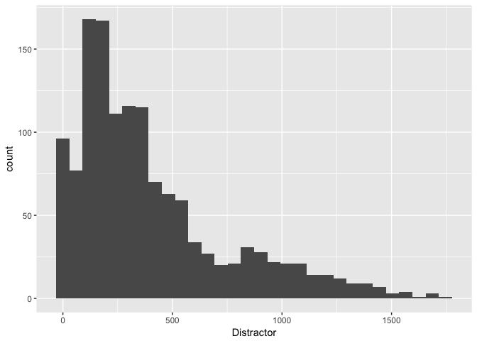<!-- -->

We can change the binwdith to more meaningful units.


```r
ggplot(cs, aes(x = Target)) + geom_histogram()
```

```
## `stat_bin()` using `bins = 30`. Pick better value with `binwidth`.
```

<!-- -->

```r
ggplot(cs, aes(x = Target)) + geom_histogram(binwidth = 100)
```

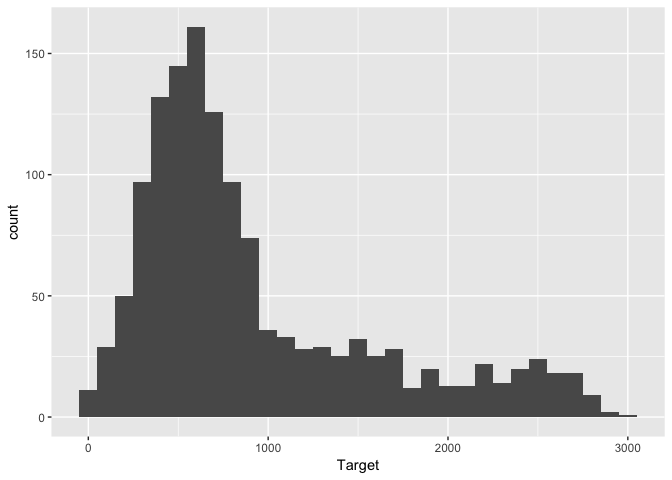<!-- -->

```r
ggplot(cs, aes(x = Target)) + geom_histogram(binwidth = 200)
```

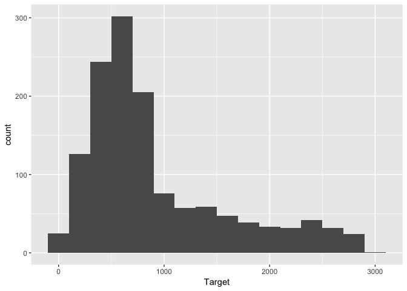<!-- -->

```r
ggplot(cs, aes(x = Target)) + geom_histogram(binwidth = 50)
```

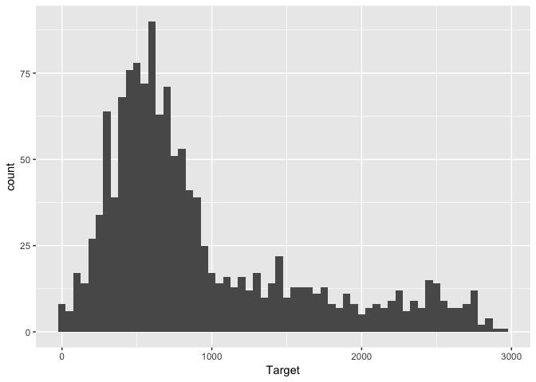<!-- -->

Visualizations let us observe whethere there are any systematic or unusual patterns in the data. We can also see whether the data is clustering (useful for detecting patterns). Let's examine each person's distribution of Target fixations. 


```r
ggplot(cs, aes(x = Target)) + 
  geom_histogram(binwidth = 200) + 
  facet_wrap(~Subject)
```

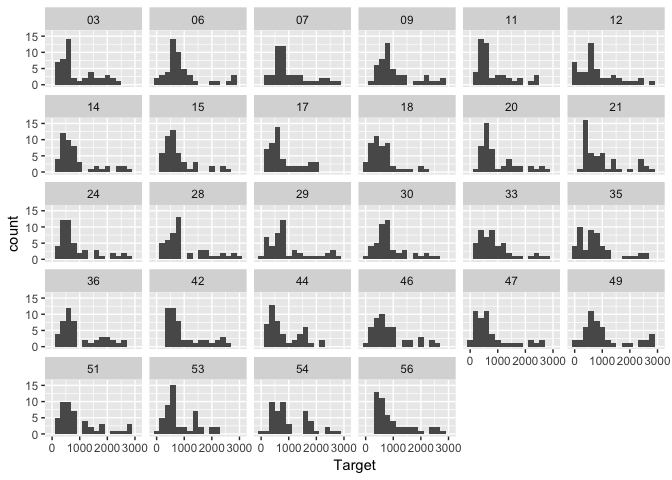<!-- -->

Maybe it would make more sense to see whether any participant had an unusual number of blinks.


```r
ggplot(cs, aes(x = Track_Loss)) + 
  geom_histogram(binwidth = 50) +
  facet_wrap(~Subject)
```

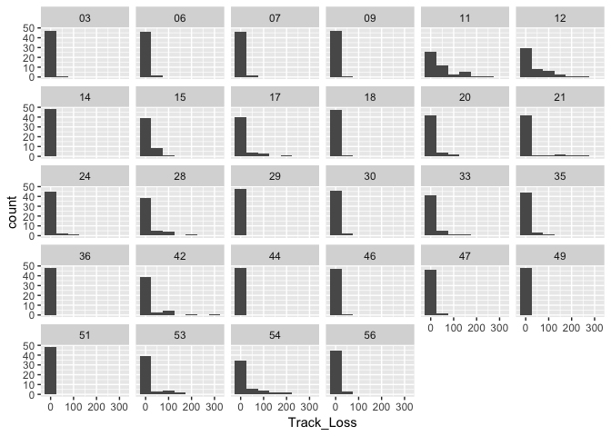<!-- -->

## Outliers

Outliers are observations that are unusual. When we get into the stats tutorial, we'll discuss systematic ways to deal with them. However, if we are very certain that something is likely due to error, then you would want to trim or remove outliers. If data from one participant is adversely affected, then one should consider removing the participant. 

## Missing Values

Sometimes a dataset may include missing values (blank cells) or the researcher may introduce missing values to maintain a tidy dataset. You may be wondering why we wouldn't use 0 instead. In some cases this may be justified (e.g., you are counting the number of correct responses--if there are not any, then 0 would be an accurate description) but in other cases, 0 may adversely affect your data. For example, in our current dataset, let's assume that blinks above 200 represent outliers and we want to replace them with missing values. In R, these would be written as NAs. We can do this with the `ifelse()` command combined with mutate to add a new column to our dataset. Because I'm significantly changing a dataset, I often times save it to a new dataset just in case I need to traceback and change something. 


```r
cs2 <- cs %>% 
  mutate(cTrack_Loss = ifelse(Track_Loss > 200, NA, Track_Loss))
```

Dealing with NAs can be really frustrating because it requires special actions. For example, if we try to get the mean value of the new variable, then we get an error. 


```r
mean(cs$Track_Loss)
```

```
## [1] 9.517857
```

```r
mean(cs2$cTrack_Loss)
```

```
## [1] NA
```

We can add an argument that tells R to explicitly not count NAs by using the additional argument `na.rm = TRUE`.


```r
mean(cs2$cTrack_Loss, na.rm = TRUE)
```

```
## [1] 8.476831
```

Notice that because we replaced values above 200 as NAs, that the overall mean shifted to a lower value. 

If we want to "count" the number of NAs we have we will also have to consider using a special command `is.na()`. This is actually command that returns a logical variable that is either TRUE or FALSE. once we have this variable created, we can then plot the distribution of missing and non-missing values over time. 


```r
cs3 <- cs2 %>% 
  mutate(missing_Track_Loss = is.na(cTrack_Loss))
ggplot(data = cs3, aes(Time.100)) +
  geom_freqpoly(aes(color = missing_Track_Loss), binwidth = 100)
```

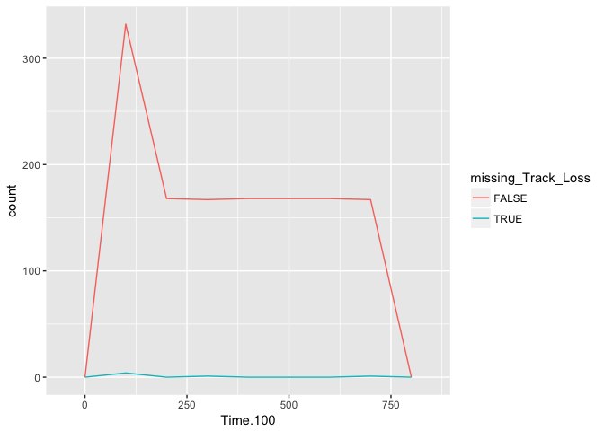<!-- -->

## Covariation

When we have a relationship between two variables, we may also explore covariation between variables. For some statistical tests, covariance is something that we would need to worry about or control (to be discussed at another lecture). In our data set, we may want to explore the distribution of Target looks by Gender. 


```r
ggplot(cs, aes(x = Target)) +
  geom_freqpoly(aes(color = Gender))
```

```
## `stat_bin()` using `bins = 30`. Pick better value with `binwidth`.
```

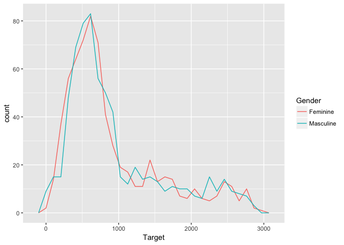<!-- -->

We see that they are fairly well matched which is great, but what happens when we look at condition type?


```r
ggplot(cs, aes(x = Target)) +
  geom_freqpoly(aes(color = Type))
```

```
## `stat_bin()` using `bins = 30`. Pick better value with `binwidth`.
```

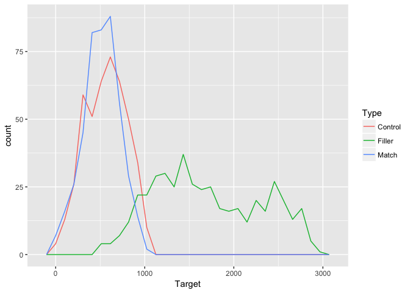<!-- -->

We see that the fillers behave very differently, which given the context of our design (there were way more fillers that control and match conditions) makes sense. 

When we want to compare two categorical variables, we can create a _contingency table_ which counts the number of unique combinations across variables. 


```r
cs %>% 
  count(Gender, Type)
```

```
## # A tibble: 6 x 3
##   Gender    Type        n
##   <chr>     <chr>   <int>
## 1 Feminine  Control   224
## 2 Feminine  Filler    224
## 3 Feminine  Match     224
## 4 Masculine Control   224
## 5 Masculine Filler    224
## 6 Masculine Match     224
```
We see that our dataset is balanced, i.e. the same number of rows per unique combination. 
What happens if we count the number of missing values of blinks per participant? 


```r
cs3 %>% 
  count(missing_Track_Loss, Subject) %>% 
  arrange(Subject)
```

```
## # A tibble: 33 x 3
##    missing_Track_Loss Subject     n
##    <lgl>              <chr>   <int>
##  1 FALSE              03         48
##  2 FALSE              06         48
##  3 FALSE              07         48
##  4 FALSE              09         48
##  5 FALSE              11         46
##  6 TRUE               11          2
##  7 FALSE              12         47
##  8 TRUE               12          1
##  9 FALSE              14         48
## 10 FALSE              15         48
## # ... with 23 more rows
```

When we have two continous variables, we can use a scatterplot to explore relationships. Remember to use the jitter option and/or transparency when there are a lot of points. 


```r
ggplot(cs, aes(x = Target, Distractor)) +
  geom_point(position = "jitter")
```

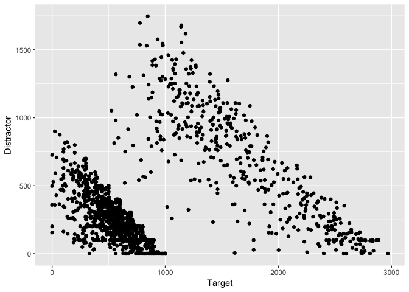<!-- -->

