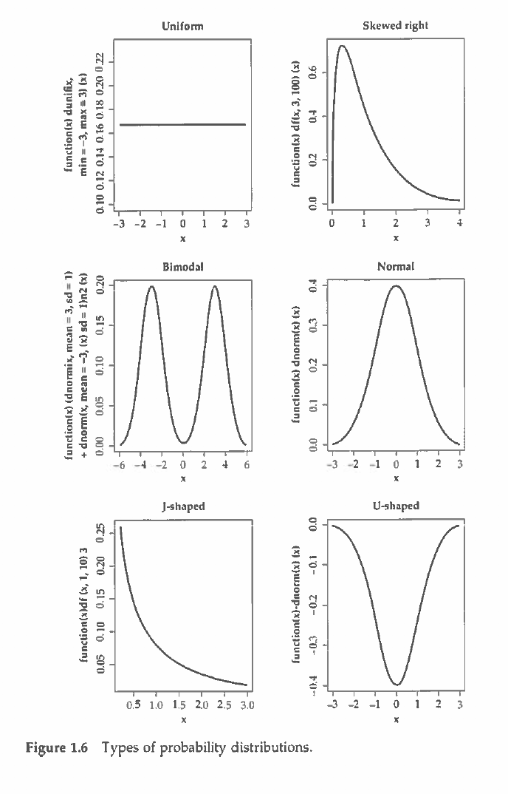

```{r setup, include=FALSE}
knitr::opts_chunk$set(echo = FALSE)
library(tidyverse)
```

## Introduction

- Perhaps the biggest myth out there is that stats is _just math_. 
- It's not as simple as $2 + 2 = 4$, rather Statistics is the science of description, probability, and inference.
- It is a set of procedures and best practices for making educated guesses.
- Instead of finding _exact_ solutions; there are only _better_ and _worse_ ones built off a set of assumptions.
- This contrast is what becomes so challenging for new researchers to grasp.

## Taking a different perspective

- Much like our approach with R this semester, I want you to become familiar with some basic concepts in Statistics, so that you can then have the information necessary to make _informed choices_
- These choices should be guided by your research questions, common practice in your discipline, and due diligence in research what statistical methods may be appropriate

## Taking a different perspective 2
- Do not make the mistake of believing that a single class or a person (senior student, professor, stats consultant) will be able to "teach" you what analysis is best for you
- The first questions will always be:
    + what is/are your research question(s)?
    + what kind of data do you have? 


## Two flavors 

- *Descriptive* statistics (today's topic)
- *Inferential* statistics

## Descriptive statistics basics

- When we have a dataset before us, there are 3 characteristics that are helpful to know about that dataset:
    + central measure
    + distribution/frequency
    + spread/dispersion

## Central Measures

- Most commonly referred to as *average* but this term is not technically specific
- 3 primary central measures (1st 2 most common for us):
    + mean: the sum of all values divided by the number of values
    + median: the number of values divided by two
    + mode: most frequent value within a variable

## Central Measures in R

```{r cars, echo = TRUE}
a <- c(2,5,7,9,12)
mean(a)
median(a)

b <- c(2,6,7,18,20)
mean(b)
median(b)
```

## Question

- Why do we need two different measures to describe the central tendency?
- We'll want to look at a graph to plot a distribution

## Normal distribution

```{r example z distribution}
x = seq(0, 5, length = 100)
y = rnorm(n = 100, mean = 2.5)
df <- as.data.frame(cbind(x,y))

ggplot(df, aes(y)) +
  geom_histogram() +
  geom_vline(aes(xintercept = mean(y)), color = "red", size = 2) +
  geom_vline(aes(xintercept = median(y)), color = "blue")

  
```


## Non-normal distribution

```{r example f-distribution}
x = seq(0, 5, length = 100)
y = df(x = x, df1 = 5, df2 = 100)
df <- as.data.frame(cbind(x,y))
ggplot(df, aes(y)) +
  geom_histogram() +
  geom_vline(aes(xintercept = mean(y)), color = "red", size = 2) +
  geom_vline(aes(xintercept = median(y)), color = "blue")
```

## Distributions

- Distributions are best viewed with a histogram
- Many of the statistical models that we use are based on an assumption of _normality_, even though our dataset may not actually be normal
- Normal distributions are characterized by a bell-shaped curve and look symmetric
- The mean and median of normal distributions are (nearly) identical
- Skewed distributions have a "tail" 
- The direction of the tail pulls the mean value, whereas the median is closer to the peak of the curve (the mode is the peak)

## Distributions Johson Chap 1



## Dispersion/Spread

- We've talked about the central measure of a dataset as well as the overall shape of a dataset
- Now we need a description of how clustered or spread out is the dataset
- This is known as the spread or dispersion of a distribution
- Measures of dispersion/spread
    + range: min and max values of a distribution
    + variance: squard absolute deviation from mean for each value
    + standard deviation: square root of variance
- Standard deviation is a commonly reported measure in our field

## Standard Deviation of 25, Mean of 50

```{r visualizing standard deviation}
y <- rnorm(n = 100, mean = 50, sd = 25)
z <- rnorm(n = 100, mean = 50, sd = 10)

df <- as.data.frame(cbind(y,z))

ggplot(df, aes(x = y)) +
  geom_histogram() +
  xlim(c(0,100))
```

## Standard deviation of 10, Mean of 50

```{r}
ggplot(df, aes(x = z)) +
  geom_histogram() +
  xlim(c(0,100))

```

## Standard Deviations cont.

- Standard deviations help us understand how much of the distribution is captured from the mean
- 1 standard deviation captures about 68% of the distribution
- 2 standard deviations captures about 95% of the distribution
- 3 standard deviations captures about 99.7% of the distribution

## Visualizing Standard Deviations

[Standard deviations distribution](https://upload.wikimedia.org/wikipedia/commons/8/8c/Standard_deviation_diagram.svg)

