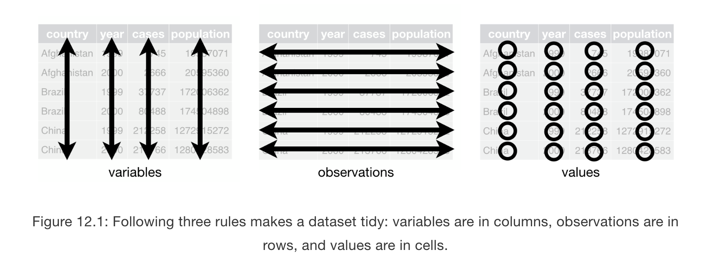
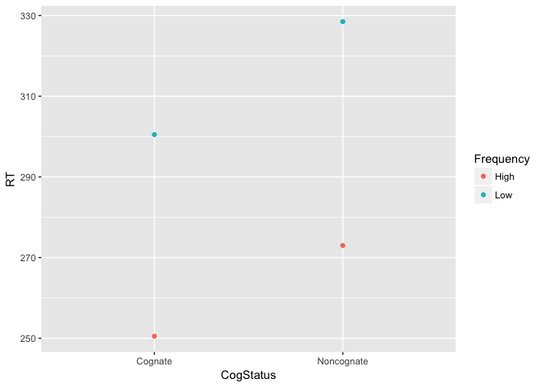

# Introduction

This week we will learn a very important concept for the `tidyverse`: _tidy data_. These notes come from the chapter on tidy data from the _R for Data Science_ book by Wickham and Grolemund. 

The concept of tidy data is related to how we organize our data. It's ultimately up to us to organize our data. As humans, we are drawn to organizing data what's called **wide** format. We organize our data where each row represents a unique level in a grouping variable (like "Group" or "Participant") and then each column has values related to our conditions. Something like this.

Participant | High Freq Cog RT | Low Freq Cog RT | High Freq NonCog RT | Low Freq NonCog RT 
--------- | --------- | --------- | ---------  | --------- 
P1 | 243 | 289 | 256 | 323
P2 | 258 | 312 | 290 | 334
... | ... | ... | ... | ...

This can be visually helpful or even cognitively useful for us humans. However, it may not be so helpful for data analysis and visualiztion. When using `ggplot2`, the commands that we use expect experimental variables to be contained in columns and the dependent variable should only be in one column. What is the problem here in our above example? 

## Rules of Tidy Data

Remember that we discussed 3 guiding principles for tidy data:

1. Each variable must have it own column.
2. Each observation must have its own row.
3. Each value must have its own cell. 

Here is a visual representation, which is the first figure in the chapter from Wickham and Grolemund. 



We can also make reference to this organization as **long** format. 

From our example dataset above, we would want to _transform_ our data in the following way:

Participant | Cognate | Frequency | RT
--------- | --------- | --------- | --------- 
P1 | Cog | High | 243 
P1 | Cog | High | 256 
P1 | NonCog | Low | 289 
P1 | NonCog | Low | 323
P2 | Cog | High | 258 
P2 | Cog | High | 290 
P2 | NonCog | Low | 312 
P2 | NonCog | Low | 334
... | ... | ... | ...

## Spreading and Gathering

Because we will often encounter untidy data, we need tools that help us get the data wrangled into tidy data. Here are two very common problems:

* one variable may be spread over multiple columns (like in our example)
* one observation may be spread across several rows

When we have the first case, usually we have the values of a variable spread across columns. Let's convert our example into a tibble.


```r
suppressMessages(library(tidyverse))
fake <- tibble(
  Participant = c("P1", "P2"),
  HighFreqCogRT = c(243,258),
  LowFreqCogRT = c(289, 312),
  HighFreqNonCogRT = c(256, 290),
  LowFreqNonCogRT = c(323, 334)
)
fake
```

```
## # A tibble: 2 x 5
##   Participant HighFreqCogRT LowFreqCogRT HighFreqNonCogRT LowFreqNonCogRT
##   <chr>               <dbl>        <dbl>            <dbl>           <dbl>
## 1 P1                    243          289              256             323
## 2 P2                    258          312              290             334
```

To make this data tidy, we will need the command `gather()`, which will take our column names and put them into their own colum and take the values and preserve their relationship to the original columns. We will place the column names into a new column which we can specify with the argument `key` and the values will then move into a new column that we can specify with the argument `value`. 


```r
fake_tidy <- fake %>% 
  gather("HighFreqCogRT", "LowFreqCogRT", "HighFreqNonCogRT", "LowFreqNonCogRT", key = "Condition", value = "RT")
fake_tidy
```

```
## # A tibble: 8 x 3
##   Participant Condition           RT
##   <chr>       <chr>            <dbl>
## 1 P1          HighFreqCogRT      243
## 2 P2          HighFreqCogRT      258
## 3 P1          LowFreqCogRT       289
## 4 P2          LowFreqCogRT       312
## 5 P1          HighFreqNonCogRT   256
## 6 P2          HighFreqNonCogRT   290
## 7 P1          LowFreqNonCogRT    323
## 8 P2          LowFreqNonCogRT    334
```

This is, of course, not exactly perfect as we would want to preserve our experimental design, but then we could recode or variables in Condition into our factor columns. We will learn other, more efficient ways to do this, but for now, we can use the `recode()` command from the `car` package. You will need to install the first time. 


```r
#install.packages("car") #uncomment if your first time
library(car)
```

```
## Loading required package: carData
```

```
## 
## Attaching package: 'car'
```

```
## The following object is masked from 'package:dplyr':
## 
##     recode
```

```
## The following object is masked from 'package:purrr':
## 
##     some
```

```r
fake_tidy$Frequency <- recode(fake_tidy$Condition, "c('HighFreqCogRT','HighFreqNonCogRT') = 'High'; else = 'Low'")
fake_tidy$CogStatus <- recode(fake_tidy$Condition, "c('HighFreqCogRT','LowFreqCogRT') = 'Cognate'; else = 'Noncognate'")
fake_tidy
```

```
## # A tibble: 8 x 5
##   Participant Condition           RT Frequency CogStatus 
##   <chr>       <chr>            <dbl> <chr>     <chr>     
## 1 P1          HighFreqCogRT      243 High      Cognate   
## 2 P2          HighFreqCogRT      258 High      Cognate   
## 3 P1          LowFreqCogRT       289 Low       Cognate   
## 4 P2          LowFreqCogRT       312 Low       Cognate   
## 5 P1          HighFreqNonCogRT   256 High      Noncognate
## 6 P2          HighFreqNonCogRT   290 High      Noncognate
## 7 P1          LowFreqNonCogRT    323 Low       Noncognate
## 8 P2          LowFreqNonCogRT    334 Low       Noncognate
```

Now, it will be easy to graph meaningful results!


```r
ggplot(fake_tidy, aes(x = CogStatus, y = RT, color = Frequency)) +
  stat_summary(fun.y = mean, geom = "point")
```

<!-- -->

```r
ggsave("Images/Fake_tidy_graph.png", height = 5, width = 7)
```

Note, the graph is not rendering in GitHub, so I will manually attach an image of the graph:


The opposite of gathering is spreading. It follows a similar argument structure as gather but now we are splitting observations that are across multiple rows into separate columns. Take a look at `table2` included in the `tidyverse`.


```r
table2
```

```
## # A tibble: 12 x 4
##    country      year type            count
##    <chr>       <int> <chr>           <int>
##  1 Afghanistan  1999 cases             745
##  2 Afghanistan  1999 population   19987071
##  3 Afghanistan  2000 cases            2666
##  4 Afghanistan  2000 population   20595360
##  5 Brazil       1999 cases           37737
##  6 Brazil       1999 population  172006362
##  7 Brazil       2000 cases           80488
##  8 Brazil       2000 population  174504898
##  9 China        1999 cases          212258
## 10 China        1999 population 1272915272
## 11 China        2000 cases          213766
## 12 China        2000 population 1280428583
```

Notice now that `type` contains identifying information for two separate measures. In other words, we have 2 DVs all contained in the variable `count` but which are split by the identifying information in `type`. Let's spread the data so that cases and population are separate columns. 


```r
table2_spread <- table2 %>% 
  spread(key = type, value = count)
table2_spread
```

```
## # A tibble: 6 x 4
##   country      year  cases population
##   <chr>       <int>  <int>      <int>
## 1 Afghanistan  1999    745   19987071
## 2 Afghanistan  2000   2666   20595360
## 3 Brazil       1999  37737  172006362
## 4 Brazil       2000  80488  174504898
## 5 China        1999 212258 1272915272
## 6 China        2000 213766 1280428583
```

These verbs make our lives much easier! Think about how you would do this in excel.

## Separate and Pull

There are two more commands that make tidying data useful. These commands are useful when you either have multiple values in one column or the same value in separate columns. Both of these forms of untidy data are, frankly, unusual for us, but it's useful to know. 

Take a look at `table3`. 


```r
table3
```

```
## # A tibble: 6 x 3
##   country      year rate             
## * <chr>       <int> <chr>            
## 1 Afghanistan  1999 745/19987071     
## 2 Afghanistan  2000 2666/20595360    
## 3 Brazil       1999 37737/172006362  
## 4 Brazil       2000 80488/174504898  
## 5 China        1999 212258/1272915272
## 6 China        2000 213766/1280428583
```

Notice that Rate has 2 values that are separated by a '/'. The first value represents cases, the second population. we can separate the column and specify a new column name for each using the argument `into`.


```r
table3 %>% 
  separate(rate, into = c("cases", "population"))
```

```
## # A tibble: 6 x 4
##   country      year cases  population
## * <chr>       <int> <chr>  <chr>     
## 1 Afghanistan  1999 745    19987071  
## 2 Afghanistan  2000 2666   20595360  
## 3 Brazil       1999 37737  172006362 
## 4 Brazil       2000 80488  174504898 
## 5 China        1999 212258 1272915272
## 6 China        2000 213766 1280428583
```

Notice now that rate has been transformed into two separate variables. Also notice that we didn't have to tell the command how to separate the variables. The default arugment is to separate by any non-alphanumeric character. If you eed to specify the separator, then use the argument `sep`. 


```r
table3 %>% 
  separate(rate, into = c("cases", "population"), sep = "/")
```

```
## # A tibble: 6 x 4
##   country      year cases  population
## * <chr>       <int> <chr>  <chr>     
## 1 Afghanistan  1999 745    19987071  
## 2 Afghanistan  2000 2666   20595360  
## 3 Brazil       1999 37737  172006362 
## 4 Brazil       2000 80488  174504898 
## 5 China        1999 212258 1272915272
## 6 China        2000 213766 1280428583
```

Finally, `unite` can be used to join the values across two columns into one column. This is similar to the "CONCATENATE" function in excel. Let's take a look at table5


```r
table5
```

```
## # A tibble: 6 x 4
##   country     century year  rate             
## * <chr>       <chr>   <chr> <chr>            
## 1 Afghanistan 19      99    745/19987071     
## 2 Afghanistan 20      00    2666/20595360    
## 3 Brazil      19      99    37737/172006362  
## 4 Brazil      20      00    80488/174504898  
## 5 China       19      99    212258/1272915272
## 6 China       20      00    213766/1280428583
```

Now we want to join century and year.


```r
table5 %>% 
  unite(new, century, year)
```

```
## # A tibble: 6 x 3
##   country     new   rate             
##   <chr>       <chr> <chr>            
## 1 Afghanistan 19_99 745/19987071     
## 2 Afghanistan 20_00 2666/20595360    
## 3 Brazil      19_99 37737/172006362  
## 4 Brazil      20_00 80488/174504898  
## 5 China       19_99 212258/1272915272
## 6 China       20_00 213766/1280428583
```

In this case, the first argument is the name of the new column, then we specify what columns we are joining. Noticing that the default action is to specify where the join happens with an underscore '_'. We can also specify the type of separator (including nothing nothing) by using the `sep` argument. 


```r
table5 %>% 
  unite(new, century, year, sep = "")
```

```
## # A tibble: 6 x 3
##   country     new   rate             
##   <chr>       <chr> <chr>            
## 1 Afghanistan 1999  745/19987071     
## 2 Afghanistan 2000  2666/20595360    
## 3 Brazil      1999  37737/172006362  
## 4 Brazil      2000  80488/174504898  
## 5 China       1999  212258/1272915272
## 6 China       2000  213766/1280428583
```

## `recode` in `tidyverse`

There is also a `recode()` function in the `tidyverse` that I didn't know about. It looks like it follows a similar syntax as the `car::recode` but may be simpler to write. Let's see if we can get a similar result using `dplyr::recode`. 


```r
fake_tidy2 <- fake %>% 
  gather(2:5,key = "Condition", value = "RT") #here we are using the numeric position of columns to specify which columns need to be gathered
fake_tidy2
```

```
## # A tibble: 8 x 3
##   Participant Condition           RT
##   <chr>       <chr>            <dbl>
## 1 P1          HighFreqCogRT      243
## 2 P2          HighFreqCogRT      258
## 3 P1          LowFreqCogRT       289
## 4 P2          LowFreqCogRT       312
## 5 P1          HighFreqNonCogRT   256
## 6 P2          HighFreqNonCogRT   290
## 7 P1          LowFreqNonCogRT    323
## 8 P2          LowFreqNonCogRT    334
```

basically, we need to write each value to its new value. I haven't figured out a way to collapse more than one value into a single value. so this may be cumbersome. We will use `mutate()` since we want to create new variables.


```r
fake_tidy4 <- fake_tidy2 %>% 
  mutate(CogStatus = dplyr::recode(Condition,
    HighFreqCogRT = "Cognate",
    LowFreqCogRT = "Cognate",
    HighFreqNonCogRT = "Noncognate",
    LowFreqNonCogRT = "Noncognate"
  ), 
  Frequency = dplyr::recode(Condition,
    HighFreqCogRT = "High",
    HighFreqNonCogRT = "High",
    LowFreqCogRT = "Low",
    LowFreqNonCogRT = "Low"
  ))
fake_tidy4
```

```
## # A tibble: 8 x 5
##   Participant Condition           RT CogStatus  Frequency
##   <chr>       <chr>            <dbl> <chr>      <chr>    
## 1 P1          HighFreqCogRT      243 Cognate    High     
## 2 P2          HighFreqCogRT      258 Cognate    High     
## 3 P1          LowFreqCogRT       289 Cognate    Low      
## 4 P2          LowFreqCogRT       312 Cognate    Low      
## 5 P1          HighFreqNonCogRT   256 Noncognate High     
## 6 P2          HighFreqNonCogRT   290 Noncognate High     
## 7 P1          LowFreqNonCogRT    323 Noncognate Low      
## 8 P2          LowFreqNonCogRT    334 Noncognate Low
```

This method may be an easier way to avoid having to keep track of so many quotes and parentheses, although there may be more typing involved. 

This worked. Now, we'll try one more method that I also found intuitive. This involves mapping functions that basically loop through values. We will learn mapping functions later, but this may be easy to use and extend.


```r
#First, extract names of levels in Condition column and save to variable
name <- levels(as.factor(fake_tidy2$Condition)) #was only recognized as character class, so needed to change to factor
name
```

```
## [1] "HighFreqCogRT"    "HighFreqNonCogRT" "LowFreqCogRT"    
## [4] "LowFreqNonCogRT"
```
Now we will need to create a new vector for each new column that codes the new values exactly in the same sequence as above.


```r
CogStatus <- c("Cognate", "Noncognate", "Cognate", "Noncognate")
Frequency <- c("High", "High", "Low", "Low")
```

we can doublecheck that everything is coded as should be by using `cbind()`.


```r
cbind(name, CogStatus, Frequency)
```

```
##      name               CogStatus    Frequency
## [1,] "HighFreqCogRT"    "Cognate"    "High"   
## [2,] "HighFreqNonCogRT" "Noncognate" "High"   
## [3,] "LowFreqCogRT"     "Cognate"    "Low"    
## [4,] "LowFreqNonCogRT"  "Noncognate" "Low"
```

Looks good, so now we will use `mutate()` to create our new variables in combination with `mapvalues()` from the `plyr` package (a predecesor to `tidyverse`), which will essentially match the original name with the new name. 


```r
fake_tidy3 <- fake_tidy2 %>% 
  mutate(CognateStatus = plyr::mapvalues(Condition, from = name, to = CogStatus), FrequencyVal = plyr::mapvalues(Condition, from = name, to = Frequency))
fake_tidy3
```

```
## # A tibble: 8 x 5
##   Participant Condition           RT CognateStatus FrequencyVal
##   <chr>       <chr>            <dbl> <chr>         <chr>       
## 1 P1          HighFreqCogRT      243 Cognate       High        
## 2 P2          HighFreqCogRT      258 Cognate       High        
## 3 P1          LowFreqCogRT       289 Cognate       Low         
## 4 P2          LowFreqCogRT       312 Cognate       Low         
## 5 P1          HighFreqNonCogRT   256 Noncognate    High        
## 6 P2          HighFreqNonCogRT   290 Noncognate    High        
## 7 P1          LowFreqNonCogRT    323 Noncognate    Low         
## 8 P2          LowFreqNonCogRT    334 Noncognate    Low
```
This worked and may be easier to type. There are other methods as well out there. 
