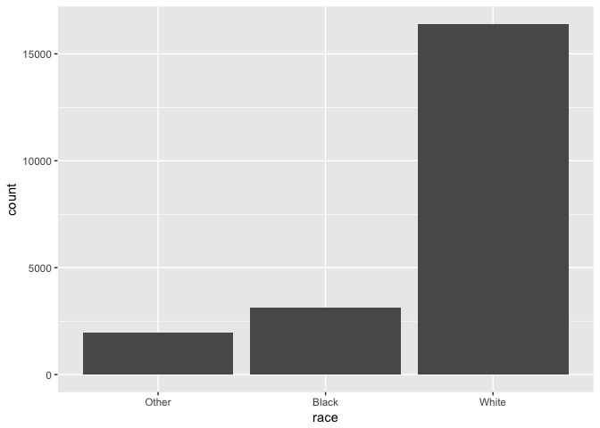
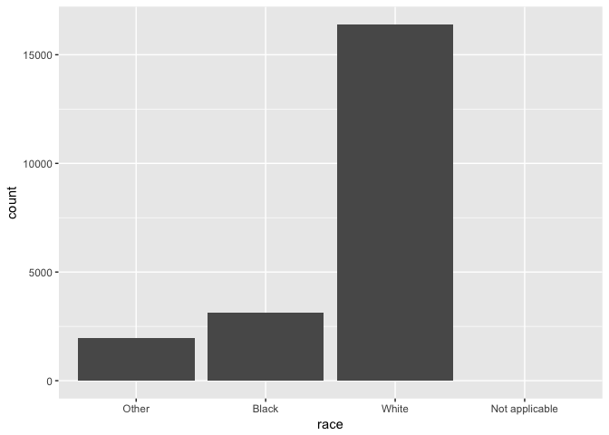
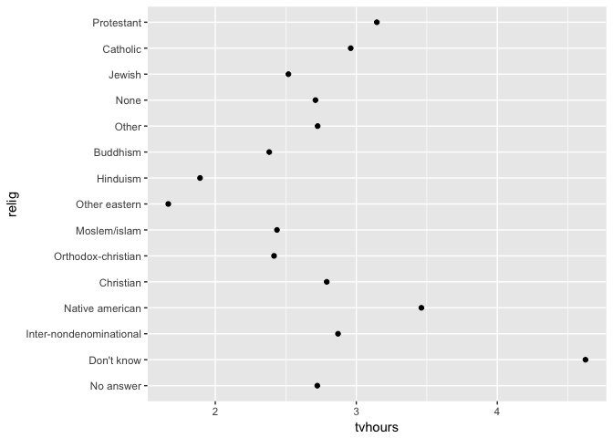
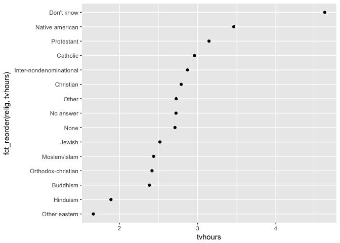
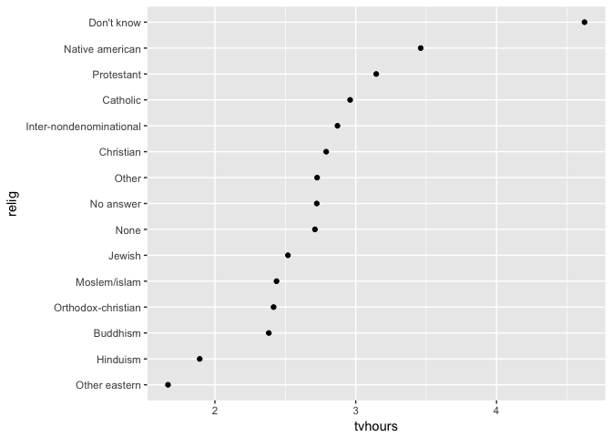
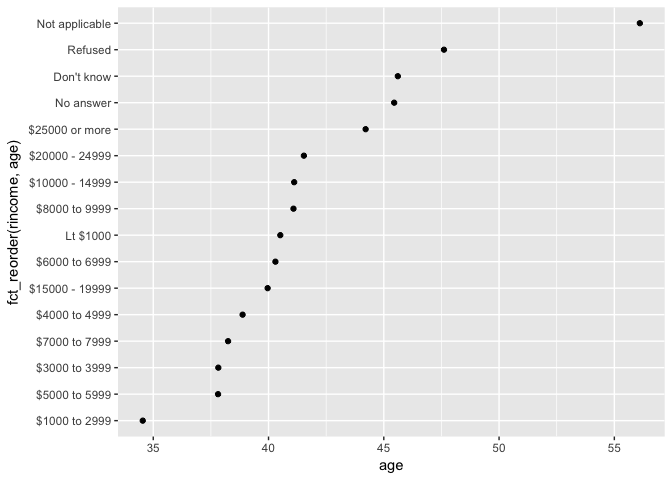
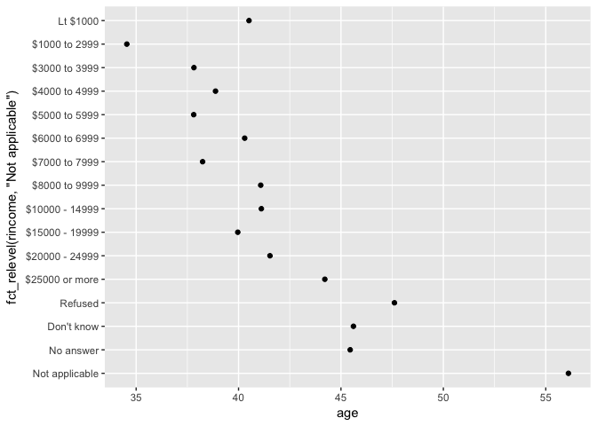
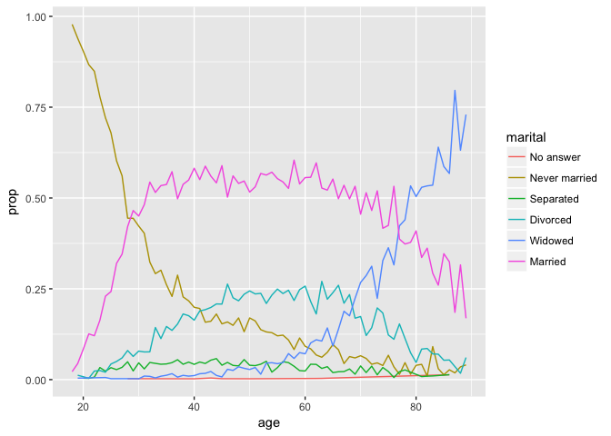
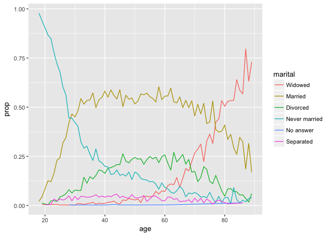
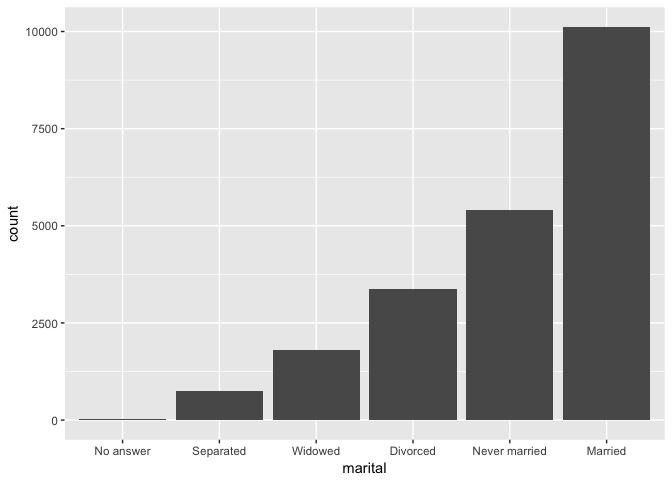

# Introduction

The notes for this week are built from Chapters 11 and 12 from the physical copy of the _R for Data Science_ book by Wickham and Grolemund. This week we will be working on pattern matching, a very useful skill that comes in very handy, especially when a dataset has typos, hidden spaces, case mismatches, etc. It does, however, require some getting used to. Let's being by initializing our R session. In particular, we are going to be working on a set of character strings that have some sort of pattern or systematicity in them, which are referred to as _regular expressions_ or _regexps_ for short. Make sure to set your working directory and load in the `tidyverse` library. Additionally, we'll be working with the `stringr` package which needs to be loaded separately.


```r
suppressMessages(library(tidyverse))
library(stringr)
```

### Creating Strings

Character strings are enclosed in quotes. We've seen examples of strings already with textual responses or even when we refer to the name of a column header. For the most part, we can enclose character strings without any problems. 


```r
ex1 <- "how do you do?"
ex2 <- "good luck!"
ex1
```

```
## [1] "how do you do?"
```

```r
ex2
```

```
## [1] "good luck!"
```

For a couple of special characters, they will need to be represented in a different way, mainly using the "\". New lines are represented as "\n" and tabs are represented as "\t". To create a vector of characters, we would need to concatenate:


```r
string <- c("a", "b", "c")
string
```

```
## [1] "a" "b" "c"
```

```r
string[3]
```

```
## [1] "c"
```

## Stringr package

Commands within the `stringr` package begin with `str_`, making them easier to remember than base R commands. For example, we can count the number of characters in each element of a character vector with `str_length()`. 


```r
str_length(c("Happy Birthday", "¿Cuántos años tienes?", "g"))
```

```
## [1] 14 21  1
```

If you want to combine several strings into one string, you can use `str_c()`. This would be particularly useful if you had to concatenate codes for a Goldvarb analysis. 


```r
str_c("a", "b", "c", "_", "x", "y", "z")
```

```
## [1] "abc_xyz"
```

If you need a separator between elements, then this can be specified in the `sep = ` argument. 


```r
str_c("H", "a", "p", "p", "y", sep = ".")
```

```
## [1] "H.a.p.p.y"
```

We can also subset strings, specifying by position which elements we want, with `start` and `end` arguments. positive numbers count from the left edge, negative numbers from the right edge. 


```r
colors <- c("red", "blue", "green")
str_sub(colors, 1, 2)
```

```
## [1] "re" "bl" "gr"
```

```r
str_sub(colors, -2,-1)
```

```
## [1] "ed" "ue" "en"
```

##Matching Patterns

This is the important part! With matching, we will be able to extract certain types of patterns, sub, etc. There are some special characters involved that specify how specific of a match we want. These are hard to remember at first but with practice they get better. We'll visualize the matches that we are complting using the `str_view()` and `str_view_all()` functions. 


```r
fruits <- c("apple", "banana", "pear")
fruits
```

```
## [1] "apple"  "banana" "pear"
```

```r
#match "an"
str_view(fruits, "an")
```

<!--html_preserve--><div id="htmlwidget-aaabf7027f7b49b7f556" style="width:960px;height:100%;" class="str_view html-widget"></div>
<script type="application/json" data-for="htmlwidget-aaabf7027f7b49b7f556">{"x":{"html":"<ul>\n  <li>apple<\/li>\n  <li>b<span class='match'>an<\/span>ana<\/li>\n  <li>pear<\/li>\n<\/ul>"},"evals":[],"jsHooks":[]}</script><!--/html_preserve-->

Notice this is an exact match and it matches the first instance of "an". If we use a "." it searches for any character except a new line. 


```r
str_view(fruits, ".a.")
```

<!--html_preserve--><div id="htmlwidget-2daf845ccbeea788ba93" style="width:960px;height:100%;" class="str_view html-widget"></div>
<script type="application/json" data-for="htmlwidget-2daf845ccbeea788ba93">{"x":{"html":"<ul>\n  <li>apple<\/li>\n  <li><span class='match'>ban<\/span>ana<\/li>\n  <li>p<span class='match'>ear<\/span><\/li>\n<\/ul>"},"evals":[],"jsHooks":[]}</script><!--/html_preserve-->

There are special ways to handle special characters--but let's just stick to the basics for now. 

We can also specify edges to search from. These are ferred to as anchors. To indicate the left edge, use "^", for the right edge, use "$". 


```r
str_view(fruits, "^a")
```

<!--html_preserve--><div id="htmlwidget-3d9ed80ff4bcb8185734" style="width:960px;height:100%;" class="str_view html-widget"></div>
<script type="application/json" data-for="htmlwidget-3d9ed80ff4bcb8185734">{"x":{"html":"<ul>\n  <li><span class='match'>a<\/span>pple<\/li>\n  <li>banana<\/li>\n  <li>pear<\/li>\n<\/ul>"},"evals":[],"jsHooks":[]}</script><!--/html_preserve-->
Notice that this looks for an a from the beginning of a string. 


```r
str_view(fruits, "a$")
```

<!--html_preserve--><div id="htmlwidget-73f519bd7946dda30e41" style="width:960px;height:100%;" class="str_view html-widget"></div>
<script type="application/json" data-for="htmlwidget-73f519bd7946dda30e41">{"x":{"html":"<ul>\n  <li>apple<\/li>\n  <li>banan<span class='match'>a<\/span><\/li>\n  <li>pear<\/li>\n<\/ul>"},"evals":[],"jsHooks":[]}</script><!--/html_preserve-->
and note that this searches for an "a" from the end of the string. 

We can combine both for more specificity.


```r
desserts <- c("apple pie", "apple", "apple tart")
str_view(desserts, "^apple$")
```

<!--html_preserve--><div id="htmlwidget-3bb1504bcf6411adbc63" style="width:960px;height:100%;" class="str_view html-widget"></div>
<script type="application/json" data-for="htmlwidget-3bb1504bcf6411adbc63">{"x":{"html":"<ul>\n  <li>apple pie<\/li>\n  <li><span class='match'>apple<\/span><\/li>\n  <li>apple tart<\/li>\n<\/ul>"},"evals":[],"jsHooks":[]}</script><!--/html_preserve-->

###More specials

Here are some additional special matches. 

  * \d matches any digit
  * \s matches any whitespace, including space, tab, newline
  * [abc] matches a, b, or c
  * [^abc] matches anything but a, b, or c
  
We can use the "or" operator (the vertical pipe, "|") to select between options. 


```r
str_view(c("grey", "gray", "groy"), "gr(e|a)y")
```

<!--html_preserve--><div id="htmlwidget-ad619c26ea9e035998fb" style="width:960px;height:100%;" class="str_view html-widget"></div>
<script type="application/json" data-for="htmlwidget-ad619c26ea9e035998fb">{"x":{"html":"<ul>\n  <li><span class='match'>grey<\/span><\/li>\n  <li><span class='match'>gray<\/span><\/li>\n  <li>groy<\/li>\n<\/ul>"},"evals":[],"jsHooks":[]}</script><!--/html_preserve-->

##Repetition
We can also specify how many times a pattern can match with the following special characers.

  * ?: 0 or 1
  * +: 1 or more
  * *: 0 or more (often referred to as wildcard character)
  
Treat these matches as literal. Following an example from the book:


```r
x <- "1888 is the longest year in Roman numberals: MDCCCLXXXVIII"
x
```

```
## [1] "1888 is the longest year in Roman numberals: MDCCCLXXXVIII"
```

matching 0 or 1 "CCs":

```r
str_view(x, "CC?")
```

<!--html_preserve--><div id="htmlwidget-0854344ec9b0fd7fb9ef" style="width:960px;height:100%;" class="str_view html-widget"></div>
<script type="application/json" data-for="htmlwidget-0854344ec9b0fd7fb9ef">{"x":{"html":"<ul>\n  <li>1888 is the longest year in Roman numberals: MD<span class='match'>CC<\/span>CLXXXVIII<\/li>\n<\/ul>"},"evals":[],"jsHooks":[]}</script><!--/html_preserve-->
We found a "CC"" without a repetition so that matches the 0 criterion.


```r
str_view(x, "CC+")
```

<!--html_preserve--><div id="htmlwidget-6f44919c6ff57f0d2be5" style="width:960px;height:100%;" class="str_view html-widget"></div>
<script type="application/json" data-for="htmlwidget-6f44919c6ff57f0d2be5">{"x":{"html":"<ul>\n  <li>1888 is the longest year in Roman numberals: MD<span class='match'>CCC<\/span>LXXXVIII<\/li>\n<\/ul>"},"evals":[],"jsHooks":[]}</script><!--/html_preserve-->
Here, the match specifies a repetition of at least once, so the answer is now "CCC".


```r
str_view(x, "C[LX]+")
```

<!--html_preserve--><div id="htmlwidget-736a4aadef46c58db8de" style="width:960px;height:100%;" class="str_view html-widget"></div>
<script type="application/json" data-for="htmlwidget-736a4aadef46c58db8de">{"x":{"html":"<ul>\n  <li>1888 is the longest year in Roman numberals: MDCC<span class='match'>CLXXX<\/span>VIII<\/li>\n<\/ul>"},"evals":[],"jsHooks":[]}</script><!--/html_preserve-->
Here, we are looking for a sequence that begins with C, must contain an L and X, then the X must repeat at least once but can be more, so final answer is "CLXXX". These symbols can be used within patterns and parentheses can be used to group things together. 


```r
str_view(c("color","colour", "collar"), "colou?r")
```

<!--html_preserve--><div id="htmlwidget-fc20fb168b5c1477966b" style="width:960px;height:100%;" class="str_view html-widget"></div>
<script type="application/json" data-for="htmlwidget-fc20fb168b5c1477966b">{"x":{"html":"<ul>\n  <li><span class='match'>color<\/span><\/li>\n  <li><span class='match'>colour<\/span><\/li>\n  <li>collar<\/li>\n<\/ul>"},"evals":[],"jsHooks":[]}</script><!--/html_preserve-->

```r
str_view("banana", "ba(na)+")
```

<!--html_preserve--><div id="htmlwidget-bdd91d710f0fca1af21d" style="width:960px;height:100%;" class="str_view html-widget"></div>
<script type="application/json" data-for="htmlwidget-bdd91d710f0fca1af21d">{"x":{"html":"<ul>\n  <li><span class='match'>banana<\/span><\/li>\n<\/ul>"},"evals":[],"jsHooks":[]}</script><!--/html_preserve-->

We can specify precise repetition matches with curly braces {}

  * {n}: exactly n
  * {n,}: no or more
  * {,m}: at most m
  * {n,m}: between n and m
  

```r
str_view(x,"C{2}")
```

<!--html_preserve--><div id="htmlwidget-89e5128c74610b5dd190" style="width:960px;height:100%;" class="str_view html-widget"></div>
<script type="application/json" data-for="htmlwidget-89e5128c74610b5dd190">{"x":{"html":"<ul>\n  <li>1888 is the longest year in Roman numberals: MD<span class='match'>CC<\/span>CLXXXVIII<\/li>\n<\/ul>"},"evals":[],"jsHooks":[]}</script><!--/html_preserve-->
search for "C" matched exactly twice. 


```r
str_view(x, "C{2,}")
```

<!--html_preserve--><div id="htmlwidget-0e915d3b64ebd1787ae1" style="width:960px;height:100%;" class="str_view html-widget"></div>
<script type="application/json" data-for="htmlwidget-0e915d3b64ebd1787ae1">{"x":{"html":"<ul>\n  <li>1888 is the longest year in Roman numberals: MD<span class='match'>CCC<\/span>LXXXVIII<\/li>\n<\/ul>"},"evals":[],"jsHooks":[]}</script><!--/html_preserve-->
match "C" at least twice

## Match detection
We've covered some basics on _regexps_. There are definitely more advanced topics, but now we'll focus on what sorts of things we can do with _regexps_. To find matches and provide a logical vector, we can use `str_detect()`:


```r
str_detect(fruits, "e")
```

```
## [1]  TRUE FALSE  TRUE
```
i.e., does our string sequence contain an "e"?

Because the logical class is treated as a binary variable, TRUE == 1 and FALSE == 0, so we can sum and calculate means. 


```r
#words is a dataset with 1000 common words
#how many start with t? 

sum(str_detect(words, "^t"))
```

```
## [1] 65
```

```r
#what proportion of words end with a vowel?
mean(str_detect(words, "[aeiou]$"))
```

```
## [1] 0.2765306
```

So we can use `str_detect()` as a means to subset specific characteristics--imagine, how helpful this would with the database exercise that you conducted!


```r
str_subset(words, "x$") # search for all words ending in x
```

```
## [1] "box" "sex" "six" "tax"
```

If instead, the words are in a column of a data frame, then we can directly use `str_detect()` with `filter()`. 


```r
df <- tibble(word = words, i = seq_along(word))

df %>% 
  filter(str_detect(words, "x$"))
```

```
## # A tibble: 4 x 2
##   word      i
##   <chr> <int>
## 1 box     108
## 2 sex     747
## 3 six     772
## 4 tax     841
```

`str_count` instead tells you how many matches there are--something that can be useful for descriptives. 


```r
str_count(fruits, "a")
```

```
## [1] 1 3 1
```

```r
#on average how many vowels per word?
mean(str_count(words, "[aeiou]"))
```

```
## [1] 1.991837
```

And we can use this with `mutate` in a data frame.


```r
df %>% 
  mutate(
    vowels = str_count(word, "[aeiou]"),
    consonants = str_count(word, "[^aeiou]")
  )
```

```
## # A tibble: 980 x 4
##    word         i vowels consonants
##    <chr>    <int>  <int>      <int>
##  1 a            1      1          0
##  2 able         2      2          2
##  3 about        3      3          2
##  4 absolute     4      4          4
##  5 accept       5      2          4
##  6 account      6      3          4
##  7 achieve      7      4          3
##  8 across       8      2          4
##  9 act          9      1          2
## 10 active      10      3          3
## # ... with 970 more rows
```

*See exercises on p. 211*

## Extracting matches

We are going to use a more complex dataset (like a corpus) to show examples with match extraction. 


```r
length(sentences)
```

```
## [1] 720
```

```r
head(sentences)
```

```
## [1] "The birch canoe slid on the smooth planks." 
## [2] "Glue the sheet to the dark blue background."
## [3] "It's easy to tell the depth of a well."     
## [4] "These days a chicken leg is a rare dish."   
## [5] "Rice is often served in round bowls."       
## [6] "The juice of lemons makes fine punch."
```

We can search for any sentences with colors in them. First, let's create a vector of color words.


```r
colors <- c("red", "orange", "yellow", "green", "blue", "purple")
#to create a regular expression, we can collapse the vector into a singular expression with vertical pipes to indicate "or"
color_match <- str_c(colors, collapse = "|")
color_match
```

```
## [1] "red|orange|yellow|green|blue|purple"
```


```r
has_color <- str_subset(sentences, color_match)
matches <- str_extract(has_color, color_match)
head(matches)
```

```
## [1] "blue" "blue" "red"  "red"  "red"  "blue"
```

This will only extract the first match. To get all matches, we'll need to use `str_extract_all()`, which returns a list (a more complex data structure).


```r
more <- sentences[str_count(sentences, color_match) > 1]
str_view_all(more, color_match)
```

<!--html_preserve--><div id="htmlwidget-42933662d5addda98e78" style="width:960px;height:100%;" class="str_view html-widget"></div>
<script type="application/json" data-for="htmlwidget-42933662d5addda98e78">{"x":{"html":"<ul>\n  <li>It is hard to erase <span class='match'>blue<\/span> or <span class='match'>red<\/span> ink.<\/li>\n  <li>The <span class='match'>green<\/span> light in the brown box flicke<span class='match'>red<\/span>.<\/li>\n  <li>The sky in the west is tinged with <span class='match'>orange<\/span> <span class='match'>red<\/span>.<\/li>\n<\/ul>"},"evals":[],"jsHooks":[]}</script><!--/html_preserve-->

```r
str_extract_all(more, color_match)
```

```
## [[1]]
## [1] "blue" "red" 
## 
## [[2]]
## [1] "green" "red"  
## 
## [[3]]
## [1] "orange" "red"
```

### Grouped matches
We can also group matches together. This is helpful when maybe you only know one piece of your pattern. In this case, we'll extract nouns from the sentences data set but selecting words that follow "a" or "the". To do this, we'll need to figure out a creative way to select the next word. Here, we are specifiying that following "a" or "the", we want a sequence of at least 1 character that is not a space. 


```r
noun <- "(a|the) ([^ ]+)"

has_noun <- sentences %>% 
  str_subset(noun) %>% 
  head(10)

has_noun %>% 
  str_extract(noun) #gives full match
```

```
##  [1] "the smooth" "the sheet"  "the depth"  "a chicken"  "the parked"
##  [6] "the sun"    "the huge"   "the ball"   "the woman"  "a helps"
```

```r
has_noun %>% 
  str_match(noun) #this instead produces a matrix
```

```
##       [,1]         [,2]  [,3]     
##  [1,] "the smooth" "the" "smooth" 
##  [2,] "the sheet"  "the" "sheet"  
##  [3,] "the depth"  "the" "depth"  
##  [4,] "a chicken"  "a"   "chicken"
##  [5,] "the parked" "the" "parked" 
##  [6,] "the sun"    "the" "sun"    
##  [7,] "the huge"   "the" "huge"   
##  [8,] "the ball"   "the" "ball"   
##  [9,] "the woman"  "the" "woman"  
## [10,] "a helps"    "a"   "helps"
```

There is a similar function `extract()` from the `tidyr` package that works like `str_match()` but where it's all kept in a data frame and the results are placed in their own columns:


```r
tibble(sentence = sentences) %>% 
  extract(
    sentence, c("article", "noun"), #named columns
    "(a|the) ([^ ])",
    remove = FALSE #necessary to retain empty matches as well
  )
```

```
## # A tibble: 720 x 3
##    sentence                                    article noun 
##    <chr>                                       <chr>   <chr>
##  1 The birch canoe slid on the smooth planks.  the     s    
##  2 Glue the sheet to the dark blue background. the     s    
##  3 It's easy to tell the depth of a well.      the     d    
##  4 These days a chicken leg is a rare dish.    a       c    
##  5 Rice is often served in round bowls.        <NA>    <NA> 
##  6 The juice of lemons makes fine punch.       <NA>    <NA> 
##  7 The box was thrown beside the parked truck. the     p    
##  8 The hogs were fed chopped corn and garbage. <NA>    <NA> 
##  9 Four hours of steady work faced us.         <NA>    <NA> 
## 10 Large size in stockings is hard to sell.    <NA>    <NA> 
## # ... with 710 more rows
```


### Backreferences
Using the parentheses, we also create distinct groups, which can be matched by position using backreferencing. We use "\" with a number to establish the reference, but becase "\" is a special character, you need another "\" in front of it to be understood within the regular expression. This is known as _escaping_.  


```r
fruit <- c("banana", "coconut", "cucumber", "jujube", "papaya", "salal berry")
str_view_all(fruit, "(..)\\1")
```

<!--html_preserve--><div id="htmlwidget-a849eed9c4aebde59bca" style="width:960px;height:100%;" class="str_view html-widget"></div>
<script type="application/json" data-for="htmlwidget-a849eed9c4aebde59bca">{"x":{"html":"<ul>\n  <li>b<span class='match'>anan<\/span>a<\/li>\n  <li><span class='match'>coco<\/span>nut<\/li>\n  <li><span class='match'>cucu<\/span>mber<\/li>\n  <li><span class='match'>juju<\/span>be<\/li>\n  <li><span class='match'>papa<\/span>ya<\/li>\n  <li>s<span class='match'>alal<\/span> berry<\/li>\n<\/ul>"},"evals":[],"jsHooks":[]}</script><!--/html_preserve-->
See exercises on p. 207.

### Replacement
I use this a lot whenever I notice any typos in my dataset. `str_replace()` will replace the first element. `str_replace_all()` will replace all matching elements. 


```r
x <- c("apple", "pear", "banana")
str_replace(x, "[aeiou]", "-")
```

```
## [1] "-pple"  "p-ar"   "b-nana"
```

```r
str_replace_all(x, "[aeiou]", "-")
```

```
## [1] "-ppl-"  "p--r"   "b-n-n-"
```

We can also do multiple replacements by enclosing with `c()`:


```r
z <- c("1 house", "2 cars", "3 people")
str_replace_all(z, c("1" = "one", "2" = "two", "3" = "three"))
```

```
## [1] "one house"    "two cars"     "three people"
```

With backreferencing, we can also make changes that are based on position. In the following example, we are switching the order of the 2nd and 3rd words.


```r
sentences %>% 
  str_replace("([^ ]+) ([^ ]+) ([^ ]+)", "\\1 \\3 \\2") %>% 
  head(5)
```

```
## [1] "The canoe birch slid on the smooth planks." 
## [2] "Glue sheet the to the dark blue background."
## [3] "It's to easy tell the depth of a well."     
## [4] "These a days chicken leg is a rare dish."   
## [5] "Rice often is served in round bowls."
```

We can use `str_split()` to split strings into smaller elements, like the text-to-columns feature in Excel. 


```r
sentences %>% 
  head(5) %>% 
  str_split(" ")
```

```
## [[1]]
## [1] "The"     "birch"   "canoe"   "slid"    "on"      "the"     "smooth" 
## [8] "planks."
## 
## [[2]]
## [1] "Glue"        "the"         "sheet"       "to"          "the"        
## [6] "dark"        "blue"        "background."
## 
## [[3]]
## [1] "It's"  "easy"  "to"    "tell"  "the"   "depth" "of"    "a"     "well."
## 
## [[4]]
## [1] "These"   "days"    "a"       "chicken" "leg"     "is"      "a"      
## [8] "rare"    "dish."  
## 
## [[5]]
## [1] "Rice"   "is"     "often"  "served" "in"     "round"  "bowls."
```

If you prefer for this to appear as a matrix (which could then be converted into a tiblle), then use the argument `simplify = TRUE`, which applies to other `stringr` functions. 


```r
sentences %>% 
  head(5) %>% 
  str_split(" ", simplify = TRUE)
```

```
##      [,1]    [,2]    [,3]    [,4]      [,5]  [,6]    [,7]    
## [1,] "The"   "birch" "canoe" "slid"    "on"  "the"   "smooth"
## [2,] "Glue"  "the"   "sheet" "to"      "the" "dark"  "blue"  
## [3,] "It's"  "easy"  "to"    "tell"    "the" "depth" "of"    
## [4,] "These" "days"  "a"     "chicken" "leg" "is"    "a"     
## [5,] "Rice"  "is"    "often" "served"  "in"  "round" "bowls."
##      [,8]          [,9]   
## [1,] "planks."     ""     
## [2,] "background." ""     
## [3,] "a"           "well."
## [4,] "rare"        "dish."
## [5,] ""            ""
```

Instead of splitting by patterns, we can also split by characters, lines, sentences, and word boundaries using `boundary()`. 


```r
i <- "This is a sentence. This is another sentence."
str_view_all(i, boundary("word"))
```

<!--html_preserve--><div id="htmlwidget-5ed5241970799d4a01fa" style="width:960px;height:100%;" class="str_view html-widget"></div>
<script type="application/json" data-for="htmlwidget-5ed5241970799d4a01fa">{"x":{"html":"<ul>\n  <li><span class='match'>This<\/span> <span class='match'>is<\/span> <span class='match'>a<\/span> <span class='match'>sentence<\/span>. <span class='match'>This<\/span> <span class='match'>is<\/span> <span class='match'>another<\/span> <span class='match'>sentence<\/span>.<\/li>\n<\/ul>"},"evals":[],"jsHooks":[]}</script><!--/html_preserve-->

```r
str_split(i, " ")[[1]]
```

```
## [1] "This"      "is"        "a"         "sentence." "This"      "is"       
## [7] "another"   "sentence."
```

```r
str_split(i, boundary("word"))[[1]]
```

```
## [1] "This"     "is"       "a"        "sentence" "This"     "is"      
## [7] "another"  "sentence"
```

Some useful base R functions that use regexps. 

```r
## this is to search in global environment of R
apropos("replace")
```

```
## [1] "%+replace%"       "replace"          "replace_na"      
## [4] "setReplaceMethod" "str_replace"      "str_replace_all" 
## [7] "str_replace_na"   "theme_replace"
```

```r
## this is to search in directory
head(dir(pattern = "\\.Rmd$"))
```

```
## [1] "0_IntroNotes.Rmd"                      
## [2] "1_MarkdownNotes.Rmd"                   
## [3] "2_ggplot2Notes.Rmd"                    
## [4] "3_dplyrNotes.Rmd"                      
## [5] "4_ExploratoryDataAnalysis_Notes_v2.Rmd"
## [6] "5_IntroStatsI.Rmd"
```

# Factors

As we've discussed in class, _factors_ are a special class of characters that are treated as categorical variables (i.e., a limited and repeated number of values or categories). Notice that working within the `tidyverse` means that the default action with strings is to treat them as _characters_. However, there are some special `tidyverse`-like functions that we can use with the `forcats` package. This needs to be uploaded separately into your R session. 


```r
library(forcats)
```

We can create a factor by specifying that we want a factor and also including the possible _levels_. We can include the levels in the order that we want (if there is an inherent order), otherwise, the default behavior is to treat levels as in alphabetical order. 


```r
x1 <- c("Dec", "Apr", "Jan", "Mar", "Jon")
```

Of course, when creating factors (or reading in a variable that should be treated as factors), it's possible to accidentally have typos. When we specify our levels, anything that is not in the list will be treated as NA; we can also ask for the error to be specified by using `parse_factor()`. 


```r
#levels
month_levels <- c("Jan", "Feb", "Mar", "Apr", "May", "Jun", "Jul", "Aug", "Sep", "Oct", "Nov", "Dec")

#create factor
y1 <- factor(x1, levels = month_levels)
y1
```

```
## [1] Dec  Apr  Jan  Mar  <NA>
## Levels: Jan Feb Mar Apr May Jun Jul Aug Sep Oct Nov Dec
```

Notice that our mispelled month "Jon" was changed to an NA. 


```r
y2 <- parse_factor(x1, levels = month_levels)
```

```
## Warning: 1 parsing failure.
## row # A tibble: 1 x 4 col     row   col expected           actual expected   <int> <int> <chr>              <chr>  actual 1     5    NA value in level set Jon
```

To access levels, just use `levels()`. 


```r
levels(y2)
```

```
##  [1] "Jan" "Feb" "Mar" "Apr" "May" "Jun" "Jul" "Aug" "Sep" "Oct" "Nov"
## [12] "Dec"
```

We are going to practice some additional functions with a built-in dataset called `gss_cat`. 


```r
gss_cat
```

```
## # A tibble: 21,483 x 9
##     year marital         age race  rincome  partyid  relig  denom  tvhours
##    <int> <fct>         <int> <fct> <fct>    <fct>    <fct>  <fct>    <int>
##  1  2000 Never married    26 White $8000 t… Ind,nea… Prote… South…      12
##  2  2000 Divorced         48 White $8000 t… Not str… Prote… Bapti…      NA
##  3  2000 Widowed          67 White Not app… Indepen… Prote… No de…       2
##  4  2000 Never married    39 White Not app… Ind,nea… Ortho… Not a…       4
##  5  2000 Divorced         25 White Not app… Not str… None   Not a…       1
##  6  2000 Married          25 White $20000 … Strong … Prote… South…      NA
##  7  2000 Never married    36 White $25000 … Not str… Chris… Not a…       3
##  8  2000 Divorced         44 White $7000 t… Ind,nea… Prote… Luthe…      NA
##  9  2000 Married          44 White $25000 … Not str… Prote… Other        0
## 10  2000 Married          47 White $25000 … Strong … Prote… South…       3
## # ... with 21,473 more rows
```

Remember that we can get an idea of the factors by using `count()` or by pltting with a bar chart. 


```r
gss_cat %>% 
  count(race)
```

```
## # A tibble: 3 x 2
##   race      n
##   <fct> <int>
## 1 Other  1959
## 2 Black  3129
## 3 White 16395
```


```r
ggplot(gss_cat, aes(race)) +
  geom_bar()
```

<!-- -->

If we want to visualize levels that didn't have any values (useful for exploratory purposes), then we can add the argument `drop = FALSE` within our scale. 


```r
ggplot(gss_cat, aes(race)) +
  geom_bar() +
  scale_x_discrete(drop = FALSE)
```

<!-- -->

There are 2 common operations that we will want to manipulate with factors:

1. reordering the levels of the factor
2. changing the values of levels

### Reordering

It is very common that for purposes of visualizations, we may need to reorder the levels. Example: let's plot the average number of hours watching TV across religions.


```r
relig <- gss_cat %>% 
  group_by(relig) %>% 
  summarize(
    age = mean(age, na.rm = TRUE),
    tvhours = mean(tvhours, na.rm = TRUE),
    n = n()
  )

ggplot(relig, aes(tvhours, relig)) +
  geom_point()
```

<!-- -->

This graph is not so easy to see. However, if we reorder the graph based on actual hours watched, it could improve the readability of the plot. We can use the `fct_reorder()` command to do this.


```r
ggplot(relig, aes(tvhours, fct_reorder(relig, tvhours))) +
  geom_point()
```

<!-- -->

Notice that the first argument was the factor and the second was how to reorder (which use the numeric values of tv watching). We could also simply reorder by using `mutate()` to change the order within the data frame itself. 


```r
relig %>% 
  mutate(relig = fct_reorder(relig, tvhours)) %>% 
  ggplot(aes(tvhours, relig)) +
  geom_point()
```

<!-- -->

Let's compare another example. This time grouping by income.


```r
rincome <- gss_cat %>% 
  group_by(rincome) %>% 
  summarize(
    age = mean(age, na.rm = TRUE),
    tvhours = mean(tvhours, na.rm = TRUE), 
    n = n()
  )

ggplot(rincome, aes(age, fct_reorder(rincome, age))) +
  geom_point()
```

<!-- -->

Here, we similarly reorderd according to the the mean(age) of a person but now, this doesn't make too much sense, given that the factor (income) has an inherent value (i.e., it is an ordinal factor). We want to preserve the ordinal nature of this factor. We can use `relevel()` to do so, which also allows us to pull specific levels to the beginning of the factor. 


```r
ggplot(rincome, aes(age, fct_relevel(rincome, "Not applicable"))) +
  geom_point()
```

<!-- -->

There are 2 more ways of reordering that are useful for graphs. `fct_reorder2()` does the reordering by largest x values. 


```r
by_age <- gss_cat %>% 
  filter(!is.na(age)) %>% 
  group_by(age, marital) %>% 
  count() %>% 
  group_by(age) %>% 
  mutate(sum = sum(n), prop = n/sum)

ggplot(by_age, aes(age, prop, color = marital)) +
  geom_line(na.rm = TRUE)
```

<!-- -->

```r
ggplot(by_age, aes(age, prop, color = fct_reorder2(marital, age, prop))) +
  geom_line() +
  labs(color = "marital")
```

<!-- -->

For bar plots, we can also use `fct_infreq()` which orders according to increasing frequency. This can be combined with `fct_rev()` to prsent in reverse order. 


```r
gss_cat %>% 
  mutate(marital = marital %>% fct_infreq() %>% fct_rev()) %>% 
  ggplot(aes(marital)) +
  geom_bar()
```

<!-- -->

### Modifying levels

This is useful for recoding labels, which will often be necessary for presentations and publications. This also allows us to collapse various levels. Let's look at party id:


```r
gss_cat %>% count(partyid)
```

```
## # A tibble: 10 x 2
##    partyid                n
##    <fct>              <int>
##  1 No answer            154
##  2 Don't know             1
##  3 Other party          393
##  4 Strong republican   2314
##  5 Not str republican  3032
##  6 Ind,near rep        1791
##  7 Independent         4119
##  8 Ind,near dem        2499
##  9 Not str democrat    3690
## 10 Strong democrat     3490
```

The levels are inconsistent and highly abbreviated. We can change this with `fct_recode()`. You can indicate what will be changed and to what it will be changed. 


```r
gss_cat %>% 
  mutate(partyid = fct_recode(partyid,
    "Republican, strong"  = "Strong republican",
    "Republican, weak"  = "Not str republican",
    "Independent, near rep" = "Ind,near rep",
    "Independent, near dem" = "Ind,near dem",
    "Democrat, weak" = "Not str democrat",
    "Democrat, strong" = "Strong democrat"
  )) %>% 
  count(partyid)
```

```
## # A tibble: 10 x 2
##    partyid                   n
##    <fct>                 <int>
##  1 No answer               154
##  2 Don't know                1
##  3 Other party             393
##  4 Republican, strong     2314
##  5 Republican, weak       3032
##  6 Independent, near rep  1791
##  7 Independent            4119
##  8 Independent, near dem  2499
##  9 Democrat, weak         3690
## 10 Democrat, strong       3490
```

Levels that are not explicitly included are left as is. To combine levels instead, we just assign the same name (although, be careful with typos!). 


```r
gss_cat %>%
  mutate(partyid = fct_recode(partyid,
    "Republican, strong"    = "Strong republican",
    "Republican, weak"      = "Not str republican",
    "Independent, near rep" = "Ind,near rep",
    "Independent, near dem" = "Ind,near dem",
    "Democrat, weak"        = "Not str democrat",
    "Democrat, strong"      = "Strong democrat",
    "Other"                 = "No answer",
    "Other"                 = "Don't know",
    "Other"                 = "Other party"
  )) %>%
  count(partyid)
```

```
## # A tibble: 8 x 2
##   partyid                   n
##   <fct>                 <int>
## 1 Other                   548
## 2 Republican, strong     2314
## 3 Republican, weak       3032
## 4 Independent, near rep  1791
## 5 Independent            4119
## 6 Independent, near dem  2499
## 7 Democrat, weak         3690
## 8 Democrat, strong       3490
```

If there is a lot of collapsing that needs to be done, there is a special function that will handle this: `fct_collapse()`. 


```r
gss_cat %>%
  mutate(partyid = fct_collapse(partyid,
    other = c("No answer", "Don't know", "Other party"),
    rep = c("Strong republican", "Not str republican"),
    ind = c("Ind,near rep", "Independent", "Ind,near dem"),
    dem = c("Not str democrat", "Strong democrat")
  )) %>%
  count(partyid)
```

```
## # A tibble: 4 x 2
##   partyid     n
##   <fct>   <int>
## 1 other     548
## 2 rep      5346
## 3 ind      8409
## 4 dem      7180
```

If we want a basic way of collapsing for visualization, we can also use `fct_lump()`. This command will simply combine smaller groups so that whatever is remaining will still remain as the smallest group. We can try this with the current dataset. 


```r
gss_cat %>%
  mutate(relig = fct_lump(relig)) %>%
  count(relig)
```

```
## # A tibble: 2 x 2
##   relig          n
##   <fct>      <int>
## 1 Protestant 10846
## 2 Other      10637
```

But we see that there are only 2 groups here because there are so many Protestant respondents. We can specify the number of groups we want as well:


```r
gss_cat %>%
  mutate(relig = fct_lump(relig, n = 10)) %>%
  count(relig, sort = TRUE) %>%
  print(n = Inf)
```

```
## # A tibble: 10 x 2
##    relig                       n
##    <fct>                   <int>
##  1 Protestant              10846
##  2 Catholic                 5124
##  3 None                     3523
##  4 Christian                 689
##  5 Other                     458
##  6 Jewish                    388
##  7 Buddhism                  147
##  8 Inter-nondenominational   109
##  9 Moslem/islam              104
## 10 Orthodox-christian         95
```

