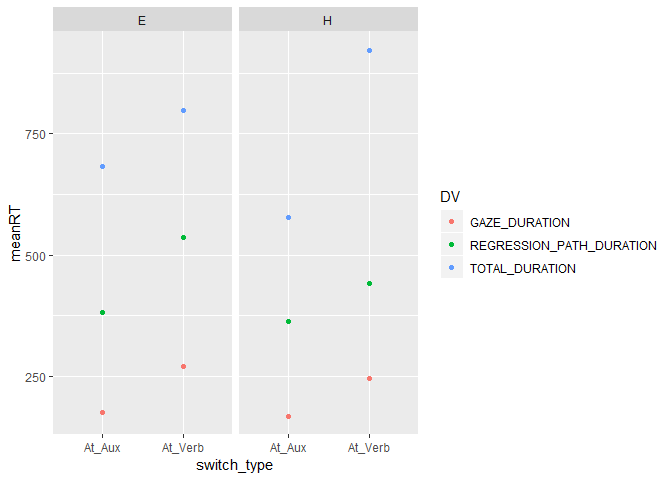

# Introduction

We are going to work on a real data set that is MESSY. We have a raw dataset that is extracted from an Eyelink eye-tracker from a reading experiment. First, because this is a new session, we will need to include the `tidyverse` packages.


```r
library(tidyverse)
```

```
## Registered S3 methods overwritten by 'ggplot2':
##   method         from 
##   [.quosures     rlang
##   c.quosures     rlang
##   print.quosures rlang
```

```
## -- Attaching packages --------
```

```
## v ggplot2 3.1.1     v purrr   0.3.2
## v tibble  2.1.1     v dplyr   0.8.1
## v tidyr   0.8.3     v stringr 1.4.0
## v readr   1.3.1     v forcats 0.4.0
```

```
## -- Conflicts -----------------
## x dplyr::filter() masks stats::filter()
## x dplyr::lag()    masks stats::lag()
```

Next, we can read in the dataset that we want to use. Last time, we used `read.csv()` to read in a simple .csv file. This time, we want to use a similar command but one that was developed within the `tidyverse` and creates a _tibble_ instead of a base R _data frames_. The command is `read_csv()`. This will make working with the large dataset a little bit more manageable. The dataset is contained within the data folder, so pay attention to the directory command.


```r
reading <- read_csv("data/L2CS_Word8_Ps11_20.csv")
```

```
## Parsed with column specification:
## cols(
##   .default = col_character(),
##   RECORDING_SESSION_LABEL = col_double(),
##   TRIAL_INDEX = col_double(),
##   CURRENT_FIX_ADJUSTED = col_logical(),
##   CURRENT_FIX_END = col_double(),
##   CURRENT_FIX_IS_RT_END = col_logical(),
##   CURRENT_FIX_MSG_COUNT = col_double(),
##   CURRENT_FIX_PUPIL = col_double(),
##   CURRENT_FIX_START = col_double(),
##   CURRENT_FIX_X = col_double(),
##   CURRENT_FIX_X_RESOLUTION = col_double(),
##   CURRENT_FIX_Y = col_double(),
##   CURRENT_FIX_Y_RESOLUTION = col_double(),
##   IP_END_EVENT_MATCHED = col_logical(),
##   IP_END_TIME = col_double(),
##   IP_START_EVENT_MATCHED = col_logical(),
##   IP_START_TIME = col_double(),
##   PREVIOUS_FIX_ANGLE = col_double(),
##   PREVIOUS_FIX_DISTANCE = col_double(),
##   PREVIOUS_FIX_DURATION = col_double(),
##   PREVIOUS_FIX_END = col_double()
##   # ... with 32 more columns
## )
```

```
## See spec(...) for full column specifications.
```

As you can see from the __Global Environment__ pane, this dataset has a very large number of columns (it was extracted without much thought into what actual columns we would need). One quick way to see all of the column names is to use the `names()` command:


```r
names(reading)
```

```
##   [1] "RECORDING_SESSION_LABEL"                       
##   [2] "TRIAL_INDEX"                                   
##   [3] "CURRENT_FIX_ADJUSTED"                          
##   [4] "CURRENT_FIX_BLINK_AROUND"                      
##   [5] "CURRENT_FIX_BUTTON_0_PRESS"                    
##   [6] "CURRENT_FIX_BUTTON_1_PRESS"                    
##   [7] "CURRENT_FIX_BUTTON_2_PRESS"                    
##   [8] "CURRENT_FIX_BUTTON_3_PRESS"                    
##   [9] "CURRENT_FIX_BUTTON_4_PRESS"                    
##  [10] "CURRENT_FIX_BUTTON_5_PRESS"                    
##  [11] "CURRENT_FIX_BUTTON_6_PRESS"                    
##  [12] "CURRENT_FIX_BUTTON_7_PRESS"                    
##  [13] "CURRENT_FIX_BUTTON_8_PRESS"                    
##  [14] "CURRENT_FIX_END"                               
##  [15] "CURRENT_FIX_END_OTHER"                         
##  [16] "CURRENT_FIX_INPUT_EVENTS"                      
##  [17] "CURRENT_FIX_INTEREST_AREAS"                    
##  [18] "CURRENT_FIX_INTEREST_AREA_DATA"                
##  [19] "CURRENT_FIX_INTEREST_AREA_DWELL_TIME"          
##  [20] "CURRENT_FIX_INTEREST_AREA_FIX_COUNT"           
##  [21] "CURRENT_FIX_INTEREST_AREA_GROUP"               
##  [22] "CURRENT_FIX_INTEREST_AREA_ID"                  
##  [23] "CURRENT_FIX_INTEREST_AREA_LABEL"               
##  [24] "CURRENT_FIX_INTEREST_AREA_PIXEL_AREA"          
##  [25] "CURRENT_FIX_INTEREST_AREA_RUN_ID"              
##  [26] "CURRENT_FIX_INTEREST_AREA_X_OFFSET"            
##  [27] "CURRENT_FIX_INTEREST_AREA_Y_OFFSET"            
##  [28] "CURRENT_FIX_IS_RT_END"                         
##  [29] "CURRENT_FIX_LABEL"                             
##  [30] "CURRENT_FIX_MSG_COUNT"                         
##  [31] "CURRENT_FIX_MSG_TEXT_1"                        
##  [32] "CURRENT_FIX_MSG_TIME_1"                        
##  [33] "CURRENT_FIX_NEAREST_INTEREST_AREA"             
##  [34] "CURRENT_FIX_NEAREST_INTEREST_AREA_DISTANCE"    
##  [35] "CURRENT_FIX_NEAREST_INTEREST_AREA_LABEL"       
##  [36] "CURRENT_FIX_PUPIL"                             
##  [37] "CURRENT_FIX_REFIX_INTEREST_AREA"               
##  [38] "CURRENT_FIX_REFIX_PREV_INTEREST_AREA"          
##  [39] "CURRENT_FIX_RUN_DWELL_TIME"                    
##  [40] "CURRENT_FIX_RUN_INDEX"                         
##  [41] "CURRENT_FIX_RUN_SIZE"                          
##  [42] "CURRENT_FIX_START"                             
##  [43] "CURRENT_FIX_START_OTHER"                       
##  [44] "CURRENT_FIX_TRIAL_SPAN"                        
##  [45] "CURRENT_FIX_X"                                 
##  [46] "CURRENT_FIX_X_OTHER"                           
##  [47] "CURRENT_FIX_X_RESOLUTION"                      
##  [48] "CURRENT_FIX_Y"                                 
##  [49] "CURRENT_FIX_Y_OTHER"                           
##  [50] "CURRENT_FIX_Y_RESOLUTION"                      
##  [51] "DATA_FILE"                                     
##  [52] "EYE_USED"                                      
##  [53] "IP_END_EVENT_MATCHED"                          
##  [54] "IP_END_TIME"                                   
##  [55] "IP_INDEX"                                      
##  [56] "IP_LABEL"                                      
##  [57] "IP_START_EVENT_MATCHED"                        
##  [58] "IP_START_TIME"                                 
##  [59] "LAST_BUTTON_PRESSED"                           
##  [60] "LAST_BUTTON_PRESSED_TIME"                      
##  [61] "LAST_BUTTON_RELEASED"                          
##  [62] "LAST_BUTTON_RELEASED_TIME"                     
##  [63] "LAST_BUTTON_TIME"                              
##  [64] "NEXT_FIX_ANGLE"                                
##  [65] "NEXT_FIX_BLINK_AROUND"                         
##  [66] "NEXT_FIX_DIRECTION"                            
##  [67] "NEXT_FIX_DISTANCE"                             
##  [68] "NEXT_FIX_DURATION"                             
##  [69] "NEXT_FIX_END"                                  
##  [70] "NEXT_FIX_END_OTHER"                            
##  [71] "NEXT_FIX_INPUT_EVENTS"                         
##  [72] "NEXT_FIX_INTEREST_AREAS"                       
##  [73] "NEXT_FIX_INTEREST_AREA_DATA"                   
##  [74] "NEXT_FIX_INTEREST_AREA_DWELL_TIME"             
##  [75] "NEXT_FIX_INTEREST_AREA_FIX_COUNT"              
##  [76] "NEXT_FIX_INTEREST_AREA_GROUP"                  
##  [77] "NEXT_FIX_INTEREST_AREA_ID"                     
##  [78] "NEXT_FIX_INTEREST_AREA_INDEX"                  
##  [79] "NEXT_FIX_INTEREST_AREA_LABEL"                  
##  [80] "NEXT_FIX_INTEREST_AREA_PIXEL_AREA"             
##  [81] "NEXT_FIX_INTEREST_AREA_RUN_ID"                 
##  [82] "NEXT_FIX_IS_RT_END"                            
##  [83] "NEXT_FIX_LABEL"                                
##  [84] "NEXT_FIX_MSG_COUNT"                            
##  [85] "NEXT_FIX_MSG_TEXT_1"                           
##  [86] "NEXT_FIX_MSG_TIME_1"                           
##  [87] "NEXT_FIX_NEAREST_INTEREST_AREA"                
##  [88] "NEXT_FIX_NEAREST_INTEREST_AREA_DISTANCE"       
##  [89] "NEXT_FIX_NEAREST_INTEREST_AREA_LABEL"          
##  [90] "NEXT_FIX_PUPIL"                                
##  [91] "NEXT_FIX_RUN_DWELL_TIME"                       
##  [92] "NEXT_FIX_RUN_INDEX"                            
##  [93] "NEXT_FIX_RUN_SIZE"                             
##  [94] "NEXT_FIX_START"                                
##  [95] "NEXT_FIX_START_OTHER"                          
##  [96] "NEXT_FIX_TRIAL_SPAN"                           
##  [97] "NEXT_FIX_X"                                    
##  [98] "NEXT_FIX_X_OTHER"                              
##  [99] "NEXT_FIX_X_RESOLUTION"                         
## [100] "NEXT_FIX_Y"                                    
## [101] "NEXT_FIX_Y_OTHER"                              
## [102] "NEXT_FIX_Y_RESOLUTION"                         
## [103] "NEXT_SAC_AMPLITUDE"                            
## [104] "NEXT_SAC_ANGLE"                                
## [105] "NEXT_SAC_AVG_VELOCITY"                         
## [106] "NEXT_SAC_BLINK_DURATION"                       
## [107] "NEXT_SAC_BLINK_END"                            
## [108] "NEXT_SAC_BLINK_START"                          
## [109] "NEXT_SAC_CONTAINS_BLINK"                       
## [110] "NEXT_SAC_DIRECTION"                            
## [111] "NEXT_SAC_DURATION"                             
## [112] "NEXT_SAC_END_INTEREST_AREAS"                   
## [113] "NEXT_SAC_END_INTEREST_AREA_ID"                 
## [114] "NEXT_SAC_END_INTEREST_AREA_INDEX"              
## [115] "NEXT_SAC_END_INTEREST_AREA_LABEL"              
## [116] "NEXT_SAC_END_TIME"                             
## [117] "NEXT_SAC_END_X"                                
## [118] "NEXT_SAC_END_X_RESOLUTION"                     
## [119] "NEXT_SAC_END_Y"                                
## [120] "NEXT_SAC_END_Y_RESOLUTION"                     
## [121] "NEXT_SAC_INDEX"                                
## [122] "NEXT_SAC_INPUT_EVENTS"                         
## [123] "NEXT_SAC_IS_RT_END"                            
## [124] "NEXT_SAC_LABEL"                                
## [125] "NEXT_SAC_MSG_COUNT"                            
## [126] "NEXT_SAC_MSG_TEXT_1"                           
## [127] "NEXT_SAC_MSG_TIME_1"                           
## [128] "NEXT_SAC_NEAREST_END_INTEREST_AREA"            
## [129] "NEXT_SAC_NEAREST_END_INTEREST_AREA_LABEL"      
## [130] "NEXT_SAC_NEAREST_START_INTEREST_AREA"          
## [131] "NEXT_SAC_NEAREST_START_INTEREST_AREA_LABEL"    
## [132] "NEXT_SAC_PEAK_VELOCITY"                        
## [133] "NEXT_SAC_START_INTEREST_AREAS"                 
## [134] "NEXT_SAC_START_INTEREST_AREA_ID"               
## [135] "NEXT_SAC_START_INTEREST_AREA_INDEX"            
## [136] "NEXT_SAC_START_INTEREST_AREA_LABEL"            
## [137] "NEXT_SAC_START_TIME"                           
## [138] "NEXT_SAC_START_X"                              
## [139] "NEXT_SAC_START_X_RESOLUTION"                   
## [140] "NEXT_SAC_START_Y"                              
## [141] "NEXT_SAC_START_Y_RESOLUTION"                   
## [142] "PREVIOUS_FIX_ANGLE"                            
## [143] "PREVIOUS_FIX_BLINK_AROUND"                     
## [144] "PREVIOUS_FIX_DIRECTION"                        
## [145] "PREVIOUS_FIX_DISTANCE"                         
## [146] "PREVIOUS_FIX_DURATION"                         
## [147] "PREVIOUS_FIX_END"                              
## [148] "PREVIOUS_FIX_END_OTHER"                        
## [149] "PREVIOUS_FIX_INPUT_EVENTS"                     
## [150] "PREVIOUS_FIX_INTEREST_AREAS"                   
## [151] "PREVIOUS_FIX_INTEREST_AREA_DATA"               
## [152] "PREVIOUS_FIX_INTEREST_AREA_DWELL_TIME"         
## [153] "PREVIOUS_FIX_INTEREST_AREA_FIX_COUNT"          
## [154] "PREVIOUS_FIX_INTEREST_AREA_GROUP"              
## [155] "PREVIOUS_FIX_INTEREST_AREA_ID"                 
## [156] "PREVIOUS_FIX_INTEREST_AREA_INDEX"              
## [157] "PREVIOUS_FIX_INTEREST_AREA_LABEL"              
## [158] "PREVIOUS_FIX_INTEREST_AREA_PIXEL_AREA"         
## [159] "PREVIOUS_FIX_INTEREST_AREA_RUN_ID"             
## [160] "PREVIOUS_FIX_IS_RT_END"                        
## [161] "PREVIOUS_FIX_LABEL"                            
## [162] "PREVIOUS_FIX_MSG_COUNT"                        
## [163] "PREVIOUS_FIX_MSG_TEXT_1"                       
## [164] "PREVIOUS_FIX_MSG_TIME_1"                       
## [165] "PREVIOUS_FIX_NEAREST_INTEREST_AREA"            
## [166] "PREVIOUS_FIX_NEAREST_INTEREST_AREA_DISTANCE"   
## [167] "PREVIOUS_FIX_NEAREST_INTEREST_AREA_LABEL"      
## [168] "PREVIOUS_FIX_PUPIL"                            
## [169] "PREVIOUS_FIX_RUN_DWELL_TIME"                   
## [170] "PREVIOUS_FIX_RUN_INDEX"                        
## [171] "PREVIOUS_FIX_RUN_SIZE"                         
## [172] "PREVIOUS_FIX_START"                            
## [173] "PREVIOUS_FIX_START_OTHER"                      
## [174] "PREVIOUS_FIX_TRIAL_SPAN"                       
## [175] "PREVIOUS_FIX_X"                                
## [176] "PREVIOUS_FIX_X_OTHER"                          
## [177] "PREVIOUS_FIX_X_RESOLUTION"                     
## [178] "PREVIOUS_FIX_Y"                                
## [179] "PREVIOUS_FIX_Y_OTHER"                          
## [180] "PREVIOUS_FIX_Y_RESOLUTION"                     
## [181] "PREVIOUS_SAC_AMPLITUDE"                        
## [182] "PREVIOUS_SAC_ANGLE"                            
## [183] "PREVIOUS_SAC_AVG_VELOCITY"                     
## [184] "PREVIOUS_SAC_BLINK_DURATION"                   
## [185] "PREVIOUS_SAC_BLINK_END"                        
## [186] "PREVIOUS_SAC_BLINK_START"                      
## [187] "PREVIOUS_SAC_CONTAINS_BLINK"                   
## [188] "PREVIOUS_SAC_DIRECTION"                        
## [189] "PREVIOUS_SAC_DURATION"                         
## [190] "PREVIOUS_SAC_END_INTEREST_AREAS"               
## [191] "PREVIOUS_SAC_END_INTEREST_AREA_ID"             
## [192] "PREVIOUS_SAC_END_INTEREST_AREA_INDEX"          
## [193] "PREVIOUS_SAC_END_INTEREST_AREA_LABEL"          
## [194] "PREVIOUS_SAC_END_TIME"                         
## [195] "PREVIOUS_SAC_END_X"                            
## [196] "PREVIOUS_SAC_END_X_RESOLUTION"                 
## [197] "PREVIOUS_SAC_END_Y"                            
## [198] "PREVIOUS_SAC_END_Y_RESOLUTION"                 
## [199] "PREVIOUS_SAC_INDEX"                            
## [200] "PREVIOUS_SAC_INPUT_EVENTS"                     
## [201] "PREVIOUS_SAC_IS_RT_END"                        
## [202] "PREVIOUS_SAC_LABEL"                            
## [203] "PREVIOUS_SAC_MSG_COUNT"                        
## [204] "PREVIOUS_SAC_MSG_TEXT_1"                       
## [205] "PREVIOUS_SAC_MSG_TIME_1"                       
## [206] "PREVIOUS_SAC_NEAREST_END_INTEREST_AREA"        
## [207] "PREVIOUS_SAC_NEAREST_END_INTEREST_AREA_LABEL"  
## [208] "PREVIOUS_SAC_NEAREST_START_INTEREST_AREA"      
## [209] "PREVIOUS_SAC_NEAREST_START_INTEREST_AREA_LABEL"
## [210] "PREVIOUS_SAC_PEAK_VELOCITY"                    
## [211] "PREVIOUS_SAC_START_INTEREST_AREAS"             
## [212] "PREVIOUS_SAC_START_INTEREST_AREA_ID"           
## [213] "PREVIOUS_SAC_START_INTEREST_AREA_INDEX"        
## [214] "PREVIOUS_SAC_START_INTEREST_AREA_LABEL"        
## [215] "PREVIOUS_SAC_START_TIME"                       
## [216] "PREVIOUS_SAC_START_X"                          
## [217] "PREVIOUS_SAC_START_X_RESOLUTION"               
## [218] "PREVIOUS_SAC_START_Y"                          
## [219] "PREVIOUS_SAC_START_Y_RESOLUTION"               
## [220] "TRIAL_FIXATION_TOTAL"                          
## [221] "TRIAL_LABEL"                                   
## [222] "TRIAL_START_TIME"                              
## [223] "VIDEO_FRAME_INDEX_END"                         
## [224] "VIDEO_FRAME_INDEX_START"                       
## [225] "VIDEO_NAME_END"                                
## [226] "VIDEO_NAME_START"                              
## [227] "aux_type"                                      
## [228] "block_description"                             
## [229] "block_order"                                   
## [230] "button_RT"                                     
## [231] "button_pressed"                                
## [232] "cognate_status"                                
## [233] "critical_region"                               
## [234] "expected_button_press"                         
## [235] "expected_response"                             
## [236] "file"                                          
## [237] "grammaticality"                                
## [238] "practice"                                      
## [239] "question"                                      
## [240] "response_accuracy"                             
## [241] "sentence"                                      
## [242] "sentence_type"                                 
## [243] "switch_type"                                   
## [244] "GAZE_DURATION"                                 
## [245] "REGRESSION_PATH_DURATION"                      
## [246] "TOTAL_DURATION"
```

This is eye-tracking reading data and contains a lot of samples of different ways to measure eye movements through word-defined interest areas. Prior to reading in this data file, the data was actually pre-processed once to create 3 new reading measures that are commonly used in psycholinguistics. These are the last 3: *GAZE_DURATION*, *REGRESSION_PATH_DURATION*, and *TOTAL_DURATION*. In addition, there are several user-definied variables that we will want. Here are the list of variables that we will want for our dataset:

  * **RECORDING_SESSION_LABEL** (Participant)
  * **aux_type** (Factor that indicates auxiliary: E = 'estar', H = 'haber')
  * **switch_type** (Factor that indicates where switch occurs: at auxiliary or participle)
  * **sentence_type** (Variable that identifies practice, experimental, or filler)
  * **sentence** (Variable that contains sentences, can be used as Items column)
  * **button_RT** (additional behavioral measure on RT for answering comprehension questions)
  * **response_accuracy** (additional behavioral measure on accuracy of comprehension questions)
  * **GAZE_DURATION**
  * **REGRESSION_PATH_DURATION**
  * **TOTAL_DURATION**
  
We can use select to narrow down the dataset to just these columns:


```r
reading_exp <- reading %>% 
  select(RECORDING_SESSION_LABEL, aux_type, switch_type, sentence_type, sentence, button_RT, response_accuracy, GAZE_DURATION, REGRESSION_PATH_DURATION, TOTAL_DURATION)
```

We can now see in the _Global Environment_ pane that our dataset has been reduced to 10 columns--much more manageable! We want to get a sense of what our **levels** are for each of our **factors**. I'm going to show you a way of iterating over our columns to get our responses:


```r
reading_exp %>% 
  select(RECORDING_SESSION_LABEL, aux_type, switch_type, sentence_type, response_accuracy) %>% 
  map(as_factor) %>% 
  map(levels)
```

```
## $RECORDING_SESSION_LABEL
##  [1] "11" "12" "13" "14" "15" "16" "17" "18" "19" "20"
## 
## $aux_type
## [1] "H" "E" "."
## 
## $switch_type
## [1] "At_Aux"  "At_Verb" "."      
## 
## $sentence_type
## [1] "Practice"        "Practice Filler" "Experimental"    "Filler"         
## [5] "."              
## 
## $response_accuracy
## [1] "correct"   "incorrect" "."
```

The `map` functions allow us to iterate commands over different vectors. There is a lot more to learn from them but for now, all you need to know is that my loop created a list with the output for each vector in each element of the loop. Notice that we have some "." which usually means an empty cell. We can filter our data, so if we do this for only experimental items and only correct items, we'll get the limited dataset that we want. 


```r
reading_exp_correct <- reading_exp %>% 
  filter(sentence_type == "Experimental" & response_accuracy == "correct")
```

One more set of tricks that we hadn't learned until now: often times, it's a lot easier to `gather` our dependent variables into a single column, with an additional column that identifies the measure. This is a principle of tidying data. For `gather()`, we need to indicate what variables we are gathering (our DVs). We can then assign them a 'key' and indicate what the values represent. 


```r
head(reading_exp_correct)
```

```
## # A tibble: 6 x 10
##   RECORDING_SESSI~ aux_type switch_type sentence_type sentence button_RT
##              <dbl> <chr>    <chr>       <chr>         <chr>    <chr>    
## 1               20 E        At_Aux      Experimental  La secr~ 465      
## 2               20 E        At_Aux      Experimental  El jefe~ 815      
## 3               20 E        At_Aux      Experimental  El supe~ -3       
## 4               20 E        At_Verb     Experimental  La comp~ 613      
## 5               20 H        At_Aux      Experimental  El repo~ 905      
## 6               20 E        At_Aux      Experimental  El comp~ 480      
## # ... with 4 more variables: response_accuracy <chr>, GAZE_DURATION <dbl>,
## #   REGRESSION_PATH_DURATION <dbl>, TOTAL_DURATION <dbl>
```

```r
reading_exp_long <- reading_exp_correct %>% 
  gather(GAZE_DURATION, REGRESSION_PATH_DURATION, TOTAL_DURATION, key = "DV", value = "RT")
head(reading_exp_long)
```

```
## # A tibble: 6 x 9
##   RECORDING_SESSI~ aux_type switch_type sentence_type sentence button_RT
##              <dbl> <chr>    <chr>       <chr>         <chr>    <chr>    
## 1               20 E        At_Aux      Experimental  La secr~ 465      
## 2               20 E        At_Aux      Experimental  El jefe~ 815      
## 3               20 E        At_Aux      Experimental  El supe~ -3       
## 4               20 E        At_Verb     Experimental  La comp~ 613      
## 5               20 H        At_Aux      Experimental  El repo~ 905      
## 6               20 E        At_Aux      Experimental  El comp~ 480      
## # ... with 3 more variables: response_accuracy <chr>, DV <chr>, RT <dbl>
```

OK, now it will be easy to calculate means and sd's based on our experimental design:


```r
reading_summary <- reading_exp_long %>% 
  group_by(aux_type, switch_type, DV) %>% 
  summarize(meanRT = mean(RT), sdRT = sd(RT))
reading_summary
```

```
## # A tibble: 12 x 5
## # Groups:   aux_type, switch_type [4]
##    aux_type switch_type DV                       meanRT  sdRT
##    <chr>    <chr>       <chr>                     <dbl> <dbl>
##  1 E        At_Aux      GAZE_DURATION              176.  135.
##  2 E        At_Aux      REGRESSION_PATH_DURATION   383.  671.
##  3 E        At_Aux      TOTAL_DURATION             683.  538.
##  4 E        At_Verb     GAZE_DURATION              271.  182.
##  5 E        At_Verb     REGRESSION_PATH_DURATION   536. 1146.
##  6 E        At_Verb     TOTAL_DURATION             797.  713.
##  7 H        At_Aux      GAZE_DURATION              169.  150.
##  8 H        At_Aux      REGRESSION_PATH_DURATION   363.  657.
##  9 H        At_Aux      TOTAL_DURATION             578   573.
## 10 H        At_Verb     GAZE_DURATION              246.  175.
## 11 H        At_Verb     REGRESSION_PATH_DURATION   442.  473.
## 12 H        At_Verb     TOTAL_DURATION             922.  510.
```

Now let's graph with points


```r
ggplot(reading_summary, aes(switch_type, meanRT, color = DV)) +
  geom_point() +
  facet_wrap(~aux_type)
```

<!-- -->

